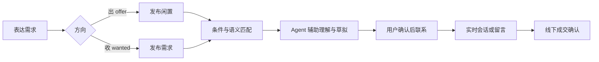
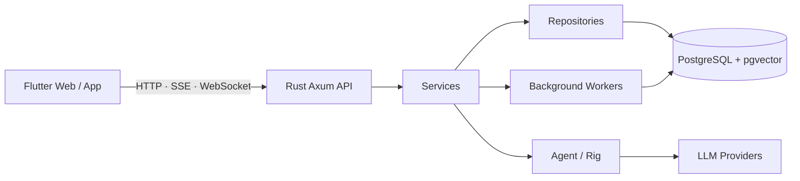

<div align="center">
  
  <h1>Goods4ncu · 续樟</h1>
  <p><strong>让校园里的每一次“出”与“收”，更自然地找到彼此。</strong></p>
  <p>Agent-first intelligent information exchange for trusted campus communities.</p>

  [](https://github.com/McTr0/Goods4ncu/actions/workflows/ci.yml)
  
  
  
  
</div>

> [!IMPORTANT]
> 续樟正在从校园二手平台演进为生产级智能信息流通平台，目前适合本地开发、演示和持续验证，尚不构成生产部署承诺。

## 续樟是什么

续樟从南昌大学校园场景出发，把传统“商品列表”升级为双向信息流：

- **出 `offer`**：发布愿意转出的闲置物品。
- **收 `wanted`**：表达预算、最低成色和偏好，让系统主动匹配可出物品。
- **Agent-first**：小帮负责搜索、解释和草拟；发布、联系、报价与成交等重要动作仍由用户确认。
- **可信沟通**：实时会话、异步留言、联系人线程、群组与频道围绕校园协作而设计。

平台不托管资金、不确认付款、不追踪物流。成交记录只表达双方的线下意向与确认。

## 核心体验



| 能力 | 当前状态 | 说明 |
| --- | --- | --- |
| 出 / 收双向发布 | 已实现 | offer 与 wanted 共用统一信息模型和分类体系 |
| 条件与语义匹配 | 已实现 | PostgreSQL + pgvector，缺少向量时安全回退 |
| Agent 小帮 | 已实现 / 持续硬化 | 搜索、发布草拟、回复辅助和受限工具调用 |
| 联系人线程 | 已实现 | 聚合同一对象的实时聊天、留言和历史会话 |
| 群组与频道 | 实验中 | 校园轻社群与公告能力 |
| 内容审核 | 已实现 / 持续硬化 | 同步文本检查、异步媒体审核和管理员审计 |
| 校园多租户 | 目标态 | CampusMembership、租户隔离和校园运营权限 |
| 生产级 Agent 确认 | 目标态 | ActionPlan、二次确认、幂等执行和完整审计 |

完整状态与交付顺序见[生产路线图](docs/roadmap.md)。

## 技术架构



- **客户端**：Flutter，支持 Web、移动端和响应式桌面布局。
- **后端**：Rust + Axum 模块化单体，handler、service、repository、agent 分层。
- **数据**：PostgreSQL 保存业务事实，pgvector 提供语义召回。
- **智能层**：Rig 与多种 OpenAI-compatible / Gemini provider，工具权限由业务服务约束。
- **可观测性**：Prometheus metrics、结构化日志、`X-Request-ID` 和稳定错误代码。

当前代码结构见[架构说明](docs/architecture.md)，生产目标见[生产架构](docs/production-architecture.md)。

## 快速开始

### 1. 准备配置

```bash
cp docs/.env.example .env
cp docs/config.toml.example goods4ncu.toml
```

至少配置 PostgreSQL、长度不少于 32 字符的 `JWT_SECRET`，以及一个可用的 LLM provider key。不要提交真实密钥。

### 2. 启动 PostgreSQL 与后端

使用 Docker Compose：

```bash
docker compose up --build
```

或者连接已经安装 pgvector 的 PostgreSQL 后直接运行：

```bash
cargo run
```

健康检查：`http://127.0.0.1:3000/api/health`

### 3. 启动 Flutter

```bash
cd mobile
flutter pub get
flutter run -d chrome \
  --dart-define=API_BASE_URL=http://127.0.0.1:3000
```

更完整的环境、数据库和排错说明见[开发指南](docs/development.md)与[运行手册](docs/operations.md)。

## 验证

```bash
# Rust
cargo fmt -- --check
cargo clippy --all-targets -- -D warnings
cargo test -- --nocapture --test-threads=1

# Flutter
cd mobile
flutter analyze
flutter test
```

涉及用户界面的功能还需要使用 Codex Browser 模拟真实用户操作，覆盖桌面/手机布局、深色模式和失败恢复路径。

## 文档入口

| 想了解什么 | 从这里开始 |
| --- | --- |
| 项目全貌与阅读路线 | [文档总入口](docs/README.md) |
| 第一次参与开发 | [新人导览](docs/onboarding.md) |
| 产品使命与“出 / 收”哲学 | [产品设计](docs/product-design.md) |
| 领域对象与状态机 | [信息模型](docs/information-model.md) |
| Agent 权限与确认机制 | [Agent 系统设计](docs/agent-system.md) |
| 审核、隐私与治理 | [信任与安全](docs/trust-safety.md) |
| 当前公共接口 | [API 参考](docs/api-reference.md) |
| 真实用户集成验收 | [集成测试手册](docs/integration-testing.md) |
| 生产化阶段与退出门槛 | [生产路线图](docs/roadmap.md) |

## 参与贡献

提交前请阅读[贡献指南](docs/contributing.md)和 [AGENTS.md](AGENTS.md)。仓库使用 Conventional Commits，并要求功能、测试、用户路径和相关文档在同一组变更中保持一致。

欢迎从测试补强、可访问性、文档勘误、校园场景研究和小型独立功能开始。生产级身份、审核、Agent 权限或数据迁移改动应先核对对应设计文档与安全边界。

---

<div align="center">
  <strong>续樟，不只是让闲置继续流动，也让需求被看见。</strong>
</div>
