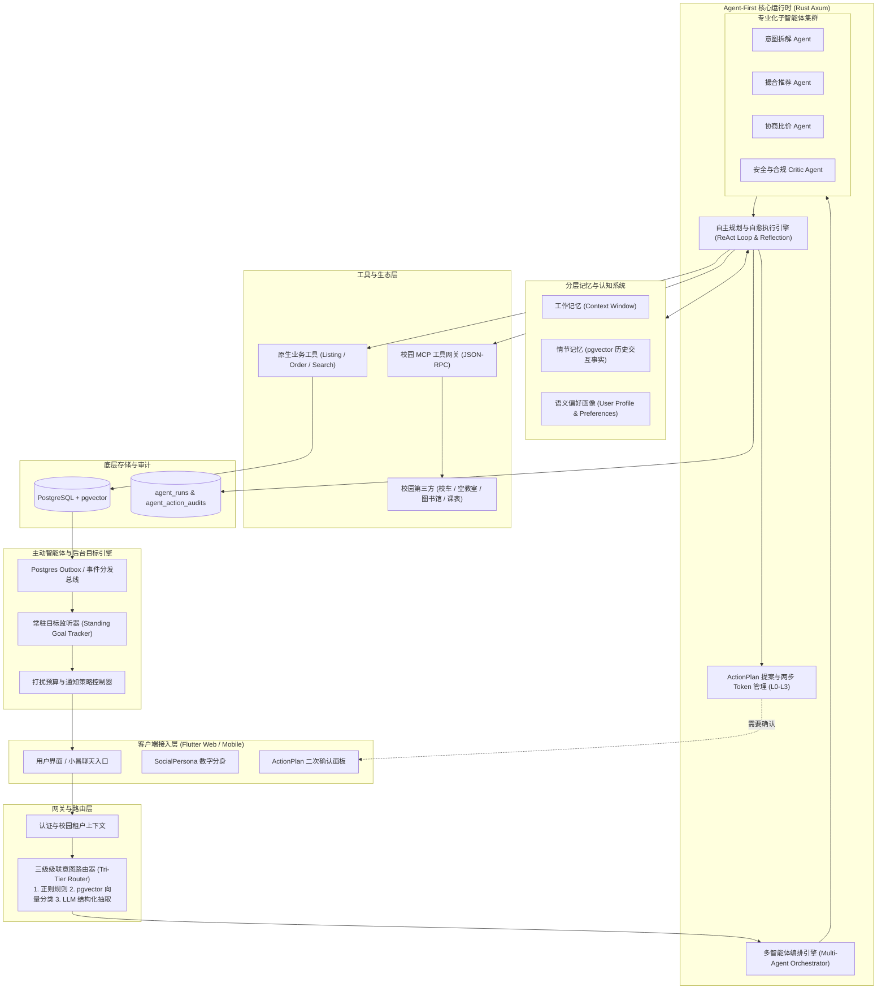
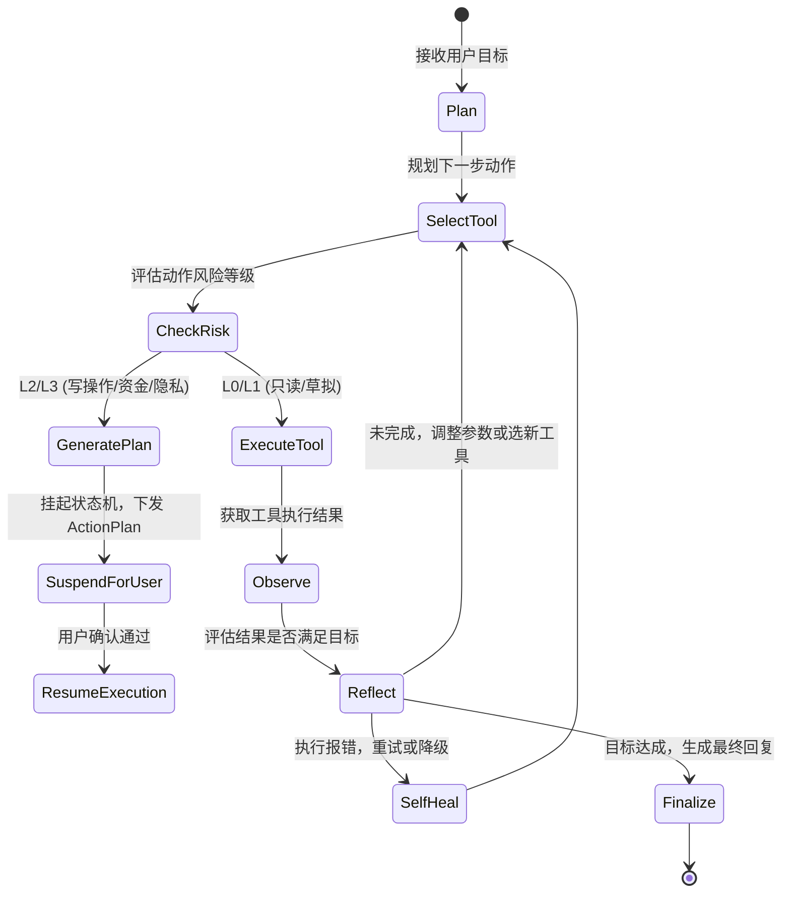
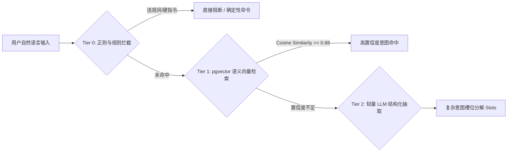
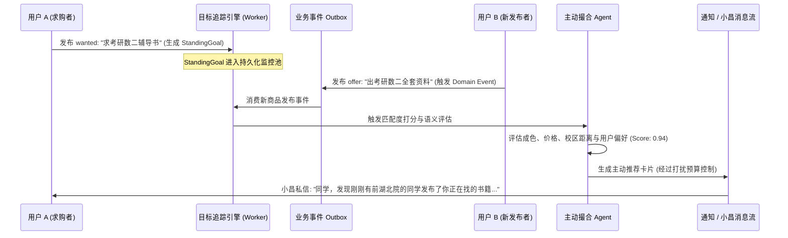
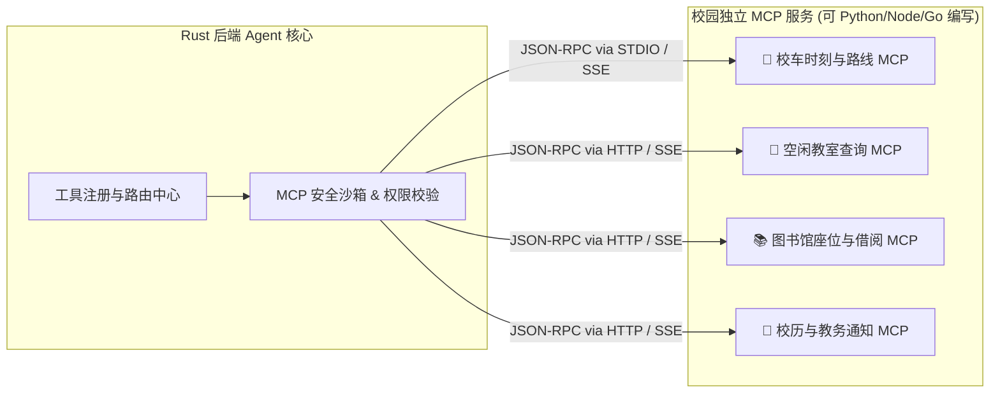
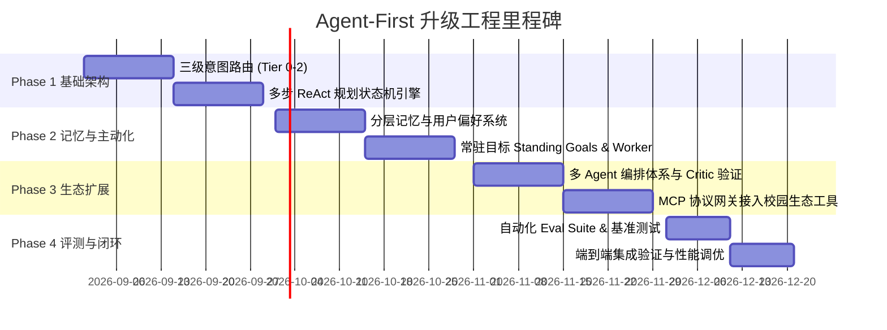

# Agent-First 系统深度升级计划

| 项目 | 内容 |
| --- | --- |
| 适用读者 | AI 架构师、后端工程师、安全工程师、产品经理与测试工程师 |
| 文档状态 | `[设计方案 / 实施路线]` |
| 目标系统 | Goods4ncu（续樟）Agent 系统（小昌及后台智能体集群） |
| 关联文档 | [agent-system.md](agent-system.md)、[ai-native-roadmap.md](ai-native-roadmap.md)、[information-model.md](information-model.md)、[architecture.md](architecture.md)、[trust-safety.md](trust-safety.md) |

---

## 一、 背景与升级目标

Goods4ncu（续樟）在早期的 Agent 实现中，构建了业界领先的**业务安全防线**——通过严密的 L0~L3 权限分级、`ActionPlan` 提案-确认机制、幂等防重以及与 PostgreSQL 事务/租户上下文的紧密绑定，确保了交易与数据层面的极高可靠性。

然而，对照现代成熟的自主 Agent（如 DeepSeek 自主 Agent 体系、Inflection Pi 级的主动与记忆系统、以及通用 Agent 框架），当前系统仍处于“**业务系统中的被动单步辅助插件**”阶段。

### 核心演进原则

1. **守住安全底线**：继承并巩固现有的 L0~L3 权限边界与 `ActionPlan` 事务机制，绝不因引入自主性而破坏“模型提案、人类处置（Model Proposes, Human Disposes）”的基本原则。
2. **从被动问答转向主动服务**：从“用户发一条、小昌回一条”升级为支持“后台持久化目标追踪（Standing Goals）与主动撮合”。
3. **从单步调用转向多步自愈推理**：支持复杂的任务规划、链式工具调用、反思与错误恢复。
4. **从孤立会话转向分层长期记忆**：构建符合隐私安全规范的用户偏好认知与情节记忆网络。
5. **从封闭硬编码走向标准协议生态**：接入标准 MCP（Model Context Protocol），无缝集成南昌大学校园生态服务。

---

## 二、 升级后架构全景



---

## 三、 七大核心模块深度技术方案

### 模块 1：自主多步 ReAct 规划与自愈执行引擎 (Autonomous ReAct & Reflection)

#### 1.1 问题现状
当前 `src/agents/tools.rs` 使用 Rig 框架进行单次工具挂载，模型仅能进行单轮 Tool Call。如果搜索无结果或工具调用报错，无法自我修正，直接终止。

#### 1.2 方案设计
在 Rust 运行时中实现带有限步保护（Bounded Execution）的 ReAct 循环引擎：



#### 1.3 核心数据结构与实现要点
- **执行预算控制**：单次请求 `max_steps = 6`，`step_timeout_ms = 4000`，最大 Token 消耗限制，防止死循环。
- **与 ActionPlan 挂起衔接**：当规划路径中出现 `L2/L3` 动作（如更新商品、接受议价），状态机保存当前执行快照（Execution Checkpoint），返回前端待确认卡片；用户确认后携带 token 恢复状态机执行。

---

### 模块 2：三级级联意图路由器 (Tri-Tier Intent Router)

#### 2.1 问题现状
`src/agents/router.rs` 目前使用静态关键字包含匹配（如 `"买"` -> Buy），容易误判且无法处理复杂自然语言。

#### 2.2 方案设计
设计三级级联分类管道，兼顾**超低延迟、低成本与高泛化能力**：



1. **Tier 0（< 1ms）**：确定性高危词、合规关键词匹配与标准系统指令快速过滤。
2. **Tier 1（5~15ms）**：将输入生成 Embedding，与预置的 `intent_exemplars` 意图样例库在 PostgreSQL (pgvector) 中进行余弦相似度匹配。
3. **Tier 2（100~300ms）**：对模糊/长文本输入，调用轻量小模型（如 MiniMax / Gemini Flash），输出结构化 `IntentDecomposition`（包含 `intent_type`, `slots`, `confidence`）。

---

### 模块 3：分层记忆与用户画像认知系统 (Hierarchical Memory & Profiling)

#### 3.1 问题现状
目前仅支持单次会话的历史滑动窗口以及全量 RAG 召回，系统对用户的校区习惯、常购品类、交易风格等缺乏跨会话的记忆累积。

#### 3.2 方案设计
构建三层记忆网络：

| 记忆层级 | 存储形态 | 生命周期 | 示例内容 | 隐私与控制 |
| :--- | :--- | :--- | :--- | :--- |
| **工作记忆 (Working Memory)** | 会话 Token 滑动窗口 | 单次会话生命周期 | 当前对话上下文、刚刚提及的预算 | 用户关闭会话即归档 |
| **情节记忆 (Episodic Memory)** | `agent_memories` 向量表 | 跨会话，长期保留 | “上周二询问过考研数学二资料但未成交” | 基于 pgvector 语义相似度按需召回 |
| **语义画像 (User Profile)** | `user_agent_profiles` 结构化表 | 持久化，持续更新 | 常驻校区：`前湖北院`；关注品类：`数码, 图书`；价格敏感度：`高` | **用户完全可见、可编辑、可一键清空** |

#### 3.3 数据库设计
```sql
CREATE TABLE user_agent_profiles (
    user_id VARCHAR(64) PRIMARY KEY REFERENCES users(id) ON DELETE CASCADE,
    campus_id UUID NOT NULL REFERENCES campuses(id),
    preferred_locations TEXT[] DEFAULT '{}',
    interested_categories TEXT[] DEFAULT '{}',
    budget_preferences JSONB DEFAULT '{}',
    custom_instructions TEXT, -- 用户自定义给小昌的系统提示词补充
    privacy_level VARCHAR(32) DEFAULT 'standard',
    updated_at TIMESTAMPTZ NOT NULL DEFAULT NOW()
);

CREATE TABLE agent_memories (
    id UUID PRIMARY KEY DEFAULT gen_random_uuid(),
    user_id VARCHAR(64) NOT NULL REFERENCES users(id) ON DELETE CASCADE,
    campus_id UUID NOT NULL REFERENCES campuses(id),
    memory_type VARCHAR(32) NOT NULL, -- 'preference', 'deal_history', 'habit'
    content TEXT NOT NULL,
    embedding vector(1536),
    source_ref VARCHAR(128),
    confidence REAL NOT NULL DEFAULT 1.0,
    created_at TIMESTAMPTZ NOT NULL DEFAULT NOW(),
    last_accessed_at TIMESTAMPTZ NOT NULL DEFAULT NOW()
);

CREATE INDEX idx_agent_memories_vector ON agent_memories USING ivfflat (embedding vector_cosine_ops);
```

---

### 模块 4：主动智能体与后台目标追踪引擎 (Proactive Standing Goal Engine)

#### 4.1 问题现状
用户发布“求购（`wanted`）”或“寻物/找搭子”后，系统只能被动等待买卖双方搜索，缺乏后台主动撮合驱动力。

#### 4.2 方案设计
将所有未满足的 `IntentItem` 实例化为**常驻目标（Standing Goal）**，由后台后台异步 Worker 驱动监听。



#### 4.3 防打扰与推送预算控制（Anti-Fatigue Policy）
- **每日推送上限**：每位用户每天最多接收 3 条由 Agent 主动发起的推荐卡片。
- **免打扰时段**：23:00 ~ 08:00 期间只记录撮合结果，不唤醒即时通知，次日早上统一汇总。
- **用户反馈抑制**：若用户点击“不再推荐此类”，立即自动降低该目标的触发权重。

---

### 模块 5：领域多 Agent 协同编排体系 (Multi-Agent Orchestration)

#### 5.1 角色定义与分工

| 子智能体角色 | 核心职责 | 工具权限 | 边界与隔离 |
| :--- | :--- | :--- | :--- |
| **Orchestrator（总调度）** | 接收用户意图，制定执行计划并委派子 Agent | 无底层数据写权限 | 仅负责分发与汇总 |
| **Intent Decomposer（意图拆解）** | 将自然语言、图片等多模态输入拆解为标准化 Slots | 视觉模型、文本槽位抽取 | 无状态计算 |
| **Market Matcher（撮合推荐）** | 执行向量与条件混合搜索，计算最优匹配矩阵 | `SearchListings`、`VectorMatch` | 只读权限 |
| **Negotiation Assistant（议价助理）** | 分析历史成交价格区间，提供合理的议价策略草稿 | `PriceDiscovery`、`DraftNegotiation` | 仅输出建议，不代为确认 |
| **Safety & Policy Critic（合规卫士）** | 独立于主流程的审查员，在生成内容和执行动作前进行二次安全评估 | `ModerationCheck`、`TenantBoundCheck` | 具备一票否决权（Veto Power） |

---

### 模块 6：校园生态 MCP（Model Context Protocol）扩展标准

#### 6.1 问题现状
新增工具需要修改 Rust 核心代码并重新编译部署，无法快速接入南昌大学校园第三方的各类异构服务。

#### 6.2 方案设计
引入开源标准的 **MCP（Model Context Protocol）客户端网关**，使 Agent 能够以标准 JSON-RPC 协议与独立部署的 MCP Server 通信。



- **统一权限映射**：所有 MCP 暴露的工具在接入时必须声明风险等级（L0~L3），受同一 `ActionPlan` 体系管辖。

---

### 模块 7：自动化 Eval 评测基准与可观测性闭环 (Agent Eval & Telemetry)

#### 7.1 评测指标与评估维度

```
               Agent 综合质量评分 (Eval Score)
   ┌───────────────────┬───────────────────┬───────────────────┐
   ▼                   ▼                   ▼                   ▼
意图识别准确率       工具调用成功率        安全性与合规率       响应延迟与成本
(Intent Accuracy)    (Tool Call Pass@1)   (Safety & Red-Team) (TTFT & Tokens)
目标: >= 96%         目标: >= 92%         目标: 100% 违规拦截 目标: TTFT < 800ms
```

#### 7.2 自动化测试集建设（Benchmarking Suite）
在 `tests/agent_eval/` 目录下构建自动化评测套件：
- `intent_bench.jsonl`：包含 500+ 条南昌大学校园真实语料（含黑话、缩写、错别字）。
- `tool_trajectory_bench.jsonl`：多步推理的黄金轨迹（Golden Trajectories）。
- `safety_adversarial_bench.jsonl`：Prompt 注入、跨租户越权、违规物品试探样本。

---

## 四、 数据库迁移详案 (Migration Spec)

在 `migrations/` 下新增递增迁移文件（如 `0089_agent_first_foundation.sql`）：

```sql
-- 1. 用户 Agent 画像与偏好配置表
CREATE TABLE IF NOT EXISTS user_agent_profiles (
    user_id VARCHAR(64) PRIMARY KEY REFERENCES users(id) ON DELETE CASCADE,
    campus_id UUID NOT NULL REFERENCES campuses(id),
    preferred_locations TEXT[] DEFAULT '{}',
    interested_categories TEXT[] DEFAULT '{}',
    budget_preferences JSONB DEFAULT '{}',
    custom_instructions TEXT,
    privacy_level VARCHAR(32) NOT NULL DEFAULT 'standard',
    is_proactive_enabled BOOLEAN NOT NULL DEFAULT true,
    daily_notification_budget INT NOT NULL DEFAULT 3,
    updated_at TIMESTAMPTZ NOT NULL DEFAULT NOW()
);

-- 2. 分层情节记忆表 (带向量索引)
CREATE TABLE IF NOT EXISTS agent_memories (
    id UUID PRIMARY KEY DEFAULT gen_random_uuid(),
    user_id VARCHAR(64) NOT NULL REFERENCES users(id) ON DELETE CASCADE,
    campus_id UUID NOT NULL REFERENCES campuses(id),
    memory_type VARCHAR(32) NOT NULL,
    content TEXT NOT NULL,
    embedding vector(1536),
    source_ref VARCHAR(128),
    confidence REAL NOT NULL DEFAULT 1.0,
    created_at TIMESTAMPTZ NOT NULL DEFAULT NOW(),
    last_accessed_at TIMESTAMPTZ NOT NULL DEFAULT NOW()
);

CREATE INDEX IF NOT EXISTS idx_agent_memories_user_campus ON agent_memories(user_id, campus_id);
CREATE INDEX IF NOT EXISTS idx_agent_memories_embedding ON agent_memories USING ivfflat (embedding vector_cosine_ops) WITH (lists = 100);

-- 3. 常驻主动目标表 (Standing Goals)
CREATE TABLE IF NOT EXISTS agent_standing_goals (
    id UUID PRIMARY KEY DEFAULT gen_random_uuid(),
    user_id VARCHAR(64) NOT NULL REFERENCES users(id) ON DELETE CASCADE,
    campus_id UUID NOT NULL REFERENCES campuses(id),
    intent_id UUID REFERENCES intent_items(id) ON DELETE SET NULL,
    goal_type VARCHAR(32) NOT NULL, -- 'wanted_match', 'price_drop', 'companion'
    description TEXT NOT NULL,
    criteria JSONB NOT NULL,
    status VARCHAR(32) NOT NULL DEFAULT 'active', -- 'active', 'paused', 'completed', 'expired'
    notifications_sent_count INT NOT NULL DEFAULT 0,
    last_triggered_at TIMESTAMPTZ,
    expires_at TIMESTAMPTZ,
    created_at TIMESTAMPTZ NOT NULL DEFAULT NOW(),
    updated_at TIMESTAMPTZ NOT NULL DEFAULT NOW()
);

CREATE INDEX IF NOT EXISTS idx_agent_standing_goals_active ON agent_standing_goals(campus_id, status) WHERE status = 'active';

-- 4. MCP 工具服务注册表
CREATE TABLE IF NOT EXISTS agent_mcp_servers (
    id UUID PRIMARY KEY DEFAULT gen_random_uuid(),
    campus_id UUID REFERENCES campuses(id) ON DELETE CASCADE,
    server_name VARCHAR(64) NOT NULL UNIQUE,
    transport_type VARCHAR(32) NOT NULL, -- 'stdio', 'sse', 'http'
    endpoint_url TEXT,
    risk_level_override VARCHAR(16) DEFAULT 'L1',
    is_enabled BOOLEAN NOT NULL DEFAULT true,
    created_at TIMESTAMPTZ NOT NULL DEFAULT NOW()
);
```

---

## 五、 分阶段落地里程碑与交付路线 (Implementation Roadmap)



### 阶段详细任务拆解

#### 阶段 1：推理引擎与意图路由升级（第 1~4 周）
- [ ] 改造 `src/agents/router.rs`：接入基于 pgvector 的语义 Embedding 路由与规则三级级联。
- [ ] 重构 `src/agents/` 运行时：实现基于有限状态机的多步 ReAct 循环，支持最大步数约束与错误自愈。
- [ ] 确保与现有 `ListingCommandService` 及 `AgentPlanService` 的 L2/L3 挂起确认逻辑完全兼容。

#### 阶段 2：分层记忆与主动智能体上线（第 5~8 周）
- [ ] 执行数据库迁移，建立 `user_agent_profiles` 与 `agent_memories`。
- [ ] 在每次会话结束后，启动轻量后台 Worker 提取偏好并存入情节记忆。
- [ ] 实现 `StandingGoalService` 与事件监听 Worker，打通求购主动匹配与推送流。
- [ ] Flutter 前端增加用户记忆管理界面（支持查看“小昌记住了我什么”、一键清除）。

#### 阶段 3：多 Agent 编排与 MCP 校园生态扩展（第 9~12 周）
- [ ] 拆分 Orchestrator、Matcher、Negotiator、Safety Critic 子代理角色。
- [ ] 实现标准 MCP Client（支持 SSE / HTTP 传输），定义南昌大学校园服务工具契约。
- [ ] 部署首批校园 MCP 服务（校车路线时刻表、图书馆空座查询）。

#### 阶段 4：自动化评测与可观测闭环（第 13~14 周）
- [ ] 建设 500+ 条真实校园语料的 Eval 数据集与自动化测试命令 `cargo test --test agent_eval`。
- [ ] 完善 Prometheus 指标与 `agent_runs` 链路追踪，监控 TTFT、Token 开销与命中率。
- [ ] 进行端到端真机验收测试与红蓝对抗安全测试。

---

## 六、 风险识别与缓解策略

| 潜在风险 | 影响程度 | 缓解对策 |
| :--- | :--- | :--- |
| **多步 ReAct 导致 Token 消耗与延迟过高** | 中高 | 1. 设置严格的 `max_steps = 6` 熔断机制；<br>2. 优先使用小型模型（如 Gemini Flash / MiniMax）执行中间规划，仅关键生成使用大模型。 |
| **主动推送造成用户打扰（Push Fatigue）** | 高 | 1. 强制执行每日上限（最多 3 条）与夜间静默策略；<br>2. 每次推送提供“减少此类推荐”与“一键暂停目标”入口。 |
| **用户画像与记忆引起隐私顾虑** | 高 | 1. 严格遵守 [trust-safety.md](trust-safety.md) 规范，不记录任何敏感个人隐私；<br>2. 记忆对用户 100% 透明，提供完全可见、可编辑、可一键清空的数据自主权。 |
| **第三方 MCP 服务不可用或超时** | 中 | 1. 设置独立的 MCP 请求超时（3000ms）；<br>2. MCP 故障时安全降级，不影响核心市场与普通聊天功能。 |

---

## 七、 总结

本升级计划紧密围绕 Goods4ncu 的校园社区与交易场景，在**完全继承现有高安全标准（L0~L3 权限、ActionPlan、租户隔离）**的基础上，系统性补齐了**自主规划、语义路由、分层记忆、主动目标追踪、多智能体协同、标准 MCP 生态与自动化 Eval 评测**。该方案具备高度的可实施性与工程严密性，将使续樟从“带有单步 AI 插件的校园集市”演进为真正领先的 **AI-Native 校园智能信息流通平台**。
