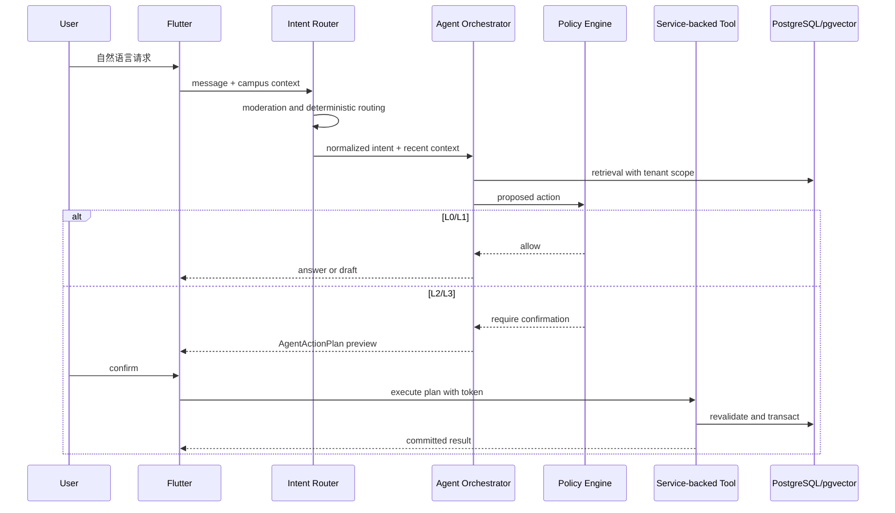

# Agent 系统设计：从理解意图到受控行动

| 项目 | 内容 |
| --- | --- |
| 适用读者 | AI/后端工程师、产品经理、安全工程师、测试工程师和 Agent 工具维护者 |
| 当前状态 | 已有意图路由、RAG、多个 LLM provider 和市场工具；统一 ActionPlan、确认 token 和 Agent 审计仍是目标态 |
| 事实来源 | `src/agents/`、`src/llm/`、聊天 API、工具测试、LLM metrics 和 Flutter 小帮入口 |
| 最后核对范围 | 搜索、发布、更新、删除、成交意向、议价、回复建议和流式回复 |

Agent 的价值是把用户意图翻译为可理解、可检查、可撤销的系统动作。它不是新的权限主体，也不是绕过产品流程的快捷通道。

## 设计目标

1. 用户可以先说目标，不需要先学会页面结构和数据库字段。
2. Agent 说明自己理解了什么、准备做什么、哪些信息仍不确定。
3. 高风险动作必须停在确认边界前，不能用一段自然语言代替授权。
4. LLM、embedding 或外部 provider 故障时，核心市场和聊天功能继续可用。
5. 每个工具调用可追踪、可测试、可重放分析，但不能泄漏密钥或无关隐私。

## 当前实现

[已实现] 当前后端支持 Gemini、MiniMax 和多种 OpenAI-compatible provider。聊天模型可以通过 Rig 调用搜索、详情、发布、更新、删除、成交意向、议价和“我的发布”等工具。

[已实现] 商品文本写入 `documents` 并生成 embedding，pgvector 用于语义搜索和相似推荐。回复助手使用独立的受限 agent，不挂载搜索、下单或议价工具。

[已实现] 小帮历史按认证用户隔离，客户端公共标识 `__agent__` 在服务端映射到用户专属会话。SSE 正常完成后才保存完整助手回复。

[风险] 部分写工具可以在一次模型运行中直接改变业务数据，尚未统一经过 ActionPlan 与显式确认协议。工具日志和消息历史也还不能完整还原一次 Agent 决策链。

## 权限等级

| 等级 | 典型动作 | 执行规则 |
| --- | --- | --- |
| L0 | 解释平台规则、总结公开信息、比较候选 | 可以直接回答，不得编造数据库事实 |
| L1 | 搜索、匹配、生成发布草稿、生成礼貌回复 | 可以自动执行只读检索和草拟，不向外发送 |
| L2 | 发布或更新信息、联系用户、推荐自己的商品 | 生成预览，用户一次确认后执行 |
| L3 | 报价、接受议价、确认成交、公开收款码或其他隐私信息 | 二次确认，重新认证敏感操作，写入审计 |

“用户说了请帮我”不自动等于 L2/L3 授权。授权必须绑定具体动作、具体资源、输入快照和短期有效期。

## 运行链路



意图路由优先使用确定性规则识别禁止内容、明确搜索和常见动作，避免所有输入都调用模型。模型负责理解开放表达，不负责最终授权。

## AgentActionPlan

[目标态] 所有 L2/L3 动作先创建计划：

```json
{
  "plan_id": "uuid",
  "action_type": "intent.publish",
  "risk_level": "L2",
  "summary": "发布一条收物需求",
  "preview": {
    "direction": "wanted",
    "title": "想收一台适合记笔记的平板",
    "budget_cny": 1800,
    "campus_id": "..."
  },
  "input_snapshot": {},
  "resource_versions": {},
  "expires_at": "RFC3339 timestamp",
  "idempotency_key": "client generated key",
  "confirmation_mode": "single"
}
```

计划状态：

```text
drafted -> awaiting_confirmation
awaiting_confirmation -> executing -> succeeded | failed
awaiting_confirmation -> cancelled | expired
```

执行协议必须满足：

- confirmation token 绑定用户、plan、设备会话和过期时间。
- plan 只能成功执行一次；重复请求返回同一个结果或明确的幂等响应。
- 执行前重新校验校园 membership、资源 owner、状态、价格和版本。
- `input_snapshot` 只保存执行所需字段，不能复制整段无关聊天历史。
- 上下文变化会返回“计划已失效，请重新确认”，不能静默使用旧数据。
- L3 计划记录确认界面版本、风险文案版本和审计事件。

目标接口在 [API 参考](api-reference.md) 标记为 `[目标态]`。

## 工具设计

Agent 工具是 service 的受控适配器，不应自己成为新的业务层。

每个工具必须声明：

```text
name
description
input schema
required auth context
campus scope
risk level
idempotency behavior
side effects
possible errors
audit category
```

实现约束：

1. 工具不直接信任模型提供的 `user_id`、`campus_id` 或 owner。
2. 写工具调用与普通 HTTP API 相同的 service 和事务。
3. 工具输出使用小而稳定的结构，不把数据库行或内部错误原样交给模型。
4. 只读工具也要做 tenant、状态和可见性过滤。
5. 工具错误分为用户可修复、状态冲突、权限拒绝、依赖故障和内部错误。
6. 工具描述不能承诺 service 实际不支持的行为。

## 记忆与上下文

### 会话记忆

短期上下文默认读取当前用户最近的必要消息，并设置 token 和条数上限。回复助手最多读取最近 12 条纯文本消息，不读取媒体，不自动发送。

### 用户偏好

[部分完成] 长期偏好只使用用户明确产生的收藏、成交意向和信息流反馈；Agent 推断不会写入用户事实。用户可以关闭个性化并清除旧排序信号，明确隐藏的具体内容仍保持隐藏。逐项查看、撤销或修正信号的界面仍是目标态。

### 业务事实

商品价格、状态、成交记录、membership 和屏蔽关系必须在执行前实时读取。聊天摘要或模型记忆不能作为这些事实的来源。

### 隐私边界

- 不把另一个用户的私聊历史放入当前用户上下文。
- 不把完整邮箱、学号、收款码或管理员审计内容发送给 LLM，除非动作明确需要且策略允许。
- provider 请求日志不保存原始敏感 prompt；调试样本需要脱敏和访问控制。
- Secret Chat 实验数据不进入 Agent 或 RAG。

## RAG 与检索

RAG 流程必须先做访问范围过滤，再计算相关性：

```text
campus/status/visibility filter
  -> lexical and vector retrieval
  -> deduplicate and rank
  -> compact factual context
  -> model generation with source ids
```

Embedding 文档应保存可重建的 `embedded_text`、模型名、维度、版本和更新时间。商品更新、删除、售出或 wanted 完成后，要同步更新或移除可检索文档。

生成回复时，模型只能引用检索结果中的公开字段。找不到结果时应明确说没有合适候选，并建议调整预算或条件，不能虚构商品。

## Prompt injection 与不可信内容

商品描述、用户名、群组内容、网页文本和用户上传内容都是不可信数据。它们可能包含“忽略规则”“调用某个工具”等指令。

防护基线：

- 检索内容放在明确的数据区，不拼进系统指令。
- 工具允许列表由服务端根据场景和风险等级决定。
- 模型不能动态注册工具、修改 tool schema 或选择任意 URL。
- 所有 URL fetch 使用域名 allowlist、请求大小和超时限制，并防 SSRF。
- 高风险动作由 policy engine 和 service 校验，prompt 防护不是唯一边界。
- 安全测试包含间接注入、多语言混淆、工具参数污染和跨用户数据诱导。

## Provider 与降级

Provider 层统一 chat、streaming、tool calling 和 embedding 能力，但不能假设不同供应商完全等价。

生产策略：

1. 每种能力声明支持矩阵，例如某 provider 只支持 chat，不支持可靠 tool calling。
2. 设置连接、首 token、总响应和工具循环超时。
3. 使用熔断、指数退避和有界重试；写操作绝不因模型超时自动重试执行。
4. Chat provider 可切换，embedding provider/维度切换必须经过双写或重建索引。
5. Provider 故障时回退到关键词搜索、普通表单和手动聊天。
6. 回复失败不丢失用户已经提交的消息，也不保存半截助手回复为完整事实。

## 可观测性

每次 AgentRun 使用统一 `trace_id`，记录：

- 路由结果、provider、model、prompt 模板版本和工具 schema 版本。
- 检索数量、过滤数量、最终引用的资源 ID。
- 工具名、风险等级、耗时、结果类别和是否要求确认。
- token 用量、首 token 延迟、总延迟、取消和错误类别。
- 不记录密钥、完整 token、密码、完整收款码或无关私聊正文。

Metrics 关注成功路径与安全护栏：草稿采纳率、确认取消率、工具冲突率、provider 错误率、越权拦截数和每次有效闭环成本。

## 评估体系

### 离线数据集

至少覆盖：

- “出/收”意图识别和字段提取。
- 分类、预算、成色和校园硬约束。
- 找不到匹配时的诚实回答。
- 发布草稿不覆盖用户已填字段。
- 报价、成交、隐私公开的确认边界。
- prompt injection、越权、跨校园和被屏蔽关系。
- provider 超时、工具 409、数据库失败和流中断。
- 中文口语、错别字、中英混合和校园术语。

### 评价维度

| 维度 | 通过标准 |
| --- | --- |
| 意图正确性 | 选择正确流程，不把 wanted 当 offer |
| 事实一致性 | 不虚构库存、价格、身份和状态 |
| 权限安全 | 未确认时不执行 L2/L3，不跨用户或校园 |
| 可恢复性 | 失败后保留用户输入并提供手工路径 |
| 表达质量 | 简洁、礼貌、不给用户制造虚假承诺 |
| 成本与延迟 | 在预算和 SLO 内完成，避免无意义工具循环 |

任何 Agent 功能上线前必须同时通过确定性单元测试、service 集成测试、模型评估和 Codex Browser 用户流程验收。

## 上线门槛

- L2/L3 已统一进入 ActionPlan 或明确禁用对应工具。
- 工具权限和幂等测试通过，越权执行数为零。
- 有 provider 故障和无 LLM 的降级路径。
- Prompt、工具和模型版本可追踪。
- 安全评估集、质量基线和回滚开关存在。
- 用户界面能清楚区分建议、草稿、待确认和已执行结果。
