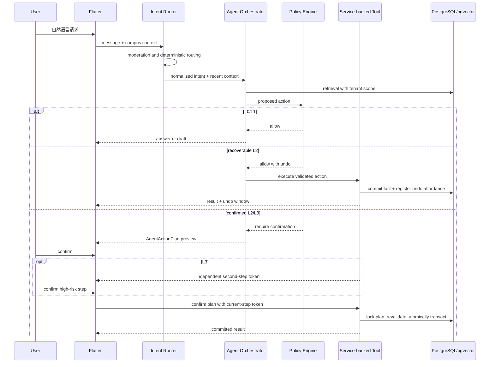

# Agent 系统设计：从理解意图到受控行动

| 项目 | 内容 |
| --- | --- |
| 适用读者 | AI/后端工程师、产品经理、安全工程师、测试工程师和 Agent 工具维护者 |
| 当前状态 | 已有意图路由、耐久 RAG 投影、多个 LLM provider 和市场工具；ActionPlan、提案幂等、ListingCommandService、listing 资源版本快照、typed terminal outcome、隐私安全行动审计和首版租户级 AgentRun envelope 已落地 |
| 事实来源 | `src/agents/`、`src/llm/`、聊天 API、工具测试、LLM metrics 和 Flutter 小帮入口 |
| 最后核对范围 | 搜索、发布、更新、删除、成交意向、议价、回复建议和流式回复 |

Agent 的价值是把用户意图翻译为可理解、可检查、可撤销的系统动作。它不是新的权限主体，也不是绕过产品流程的快捷通道。

## 设计目标

1. 用户可以先说目标，不需要先学会页面结构和数据库字段。
2. Agent 说明自己理解了什么、准备做什么、哪些信息仍不确定。
3. 高风险动作必须停在确认边界前，不能用一段自然语言代替授权。
4. LLM、embedding 或外部 provider 故障时，核心市场和聊天功能继续可用。
5. 每个工具调用可追踪、可测试、可重放分析，但不能泄漏密钥或无关隐私。

## 当前实现

[已实现] 当前后端支持 Gemini、MiniMax 和多种 OpenAI-compatible provider。聊天模型可以通过 Rig 调用搜索、详情、发布、更新、删除、成交意向、议价和“我的发布”等工具。

[已实现] 商品事务推进 `content_revision` 并合并 `embedding_jobs`；worker 在事务外调用 provider，以 revision CAS 重建或删除 `documents` 投影。provider 故障不回滚发布，pgvector 缺失时由关键词/规则路径降级。回复助手使用独立的受限 agent，不挂载搜索、下单或议价工具。

[已实现] 小帮历史按认证用户隔离，客户端公共标识 `__agent__` 在服务端映射到用户专属会话。SSE 正常完成后才保存完整助手回复。

[已实现] 可恢复的发布会立即执行并提供撤销窗口；更新/删除生成 L2 ActionPlan，成交意向/议价生成使用独立两步 token 的 L3 ActionPlan。确认锁、业务事实、适用时的通知/outbox 和计划终态原子提交，commit 前中断可安全重试。

[已实现] Agent listing 创建/更新与 HTTP 路径已收敛到同一 `ListingCommandService`，共享文本审核、分类/空白规范化、金额类型和事务入口。更新/下架/成交意向/议价计划在提案时保存数据库 `content_revision`，确认时在同一锁内比较，过期计划安全失败；HTTP 更新支持 `expected_content_revision`/`If-Match`。Agent 提案可携带认证请求的 `Idempotency-Key`，服务端按用户/校园和动作参数 SHA-256 绑定重试；相同 key 的相同请求复用原计划，参数变化安全拒绝。计划终态现在同时保存受限的 `result_code`；`agent_action_audits` 在同一事务中记录提案、重放、确认、执行、失败、取消和过期事件，只保留 trace、租户、动作/风险、结果类别、耗时和固定元数据，不保存正文、token 或完整错误。`agent_runs`/`agent_run_events` 已为活动校园聊天写入受限的路由、provider/model、版本、检索聚合、工具类别、耗时和 typed outcome，并提供只读安全列表；设备/重新认证绑定、版本化风险文案和完整 token/TTFT/cancel 对账仍待补齐。

## 权限等级

| 等级 | 典型动作 | 执行规则 |
| --- | --- | --- |
| L0 | 解释平台规则、总结公开信息、比较候选 | 可以直接回答，不得编造数据库事实 |
| L1 | 搜索、匹配、生成发布草稿、生成礼貌回复 | 可以自动执行只读检索和草拟，不向外发送 |
| L2 可恢复 | 当前的商品发布 | 校验后立即执行，向用户展示有期限、条件式撤销入口 |
| L2 需确认 | 当前的商品更新/下架；未来不可安全撤销的外部动作 | 生成绑定输入的预览，用户一次确认后执行 |
| L3 | 报价、接受议价、确认成交、公开收款码或其他隐私信息 | 二次确认，重新认证敏感操作，写入审计 |

“用户说了请帮我”不自动等于 L2/L3 授权。授权必须绑定具体动作、具体资源、输入快照和短期有效期。

## 运行链路



意图路由优先使用确定性规则识别禁止内容、明确搜索和常见动作，避免所有输入都调用模型。模型负责理解开放表达，不负责最终授权。

## AgentActionPlan

[已实现] 当前 update/delete listing 使用 L2 计划，purchase/negotiate 使用 L3 计划。创建计划的内部事实形态为：

```json
{
  "plan_id": "uuid",
  "action_type": "purchase_item",
  "risk_level": "L3",
  "summary": "以 1800 元向卖家提出成交意向",
  "args": {
    "listing_id": "...",
    "offered_price": 180000
  },
  "campus_id": "...",
  "user_id": "...",
  "status": "pending",
  "expires_at": "RFC3339 timestamp",
  "confirmation_token": "primary capability",
  "second_confirmation_token": "server-held capability"
}
```

计划状态：

```text
pending -> confirmed_once (L3) -> executing (transaction-local) -> executed | failed
pending | confirmed_once -> cancelled | expired
legacy executing -> interrupted
```

当前执行协议：

- plan 绑定创建时的用户、campus 和过期时间；list/cancel/confirm 都按认证用户与活动校园过滤。
- L3 primary 与 second token 独立。primary 只能进入 `confirmed_once`；primary 的网络重试重放同一 second-token challenge，不能执行。
- plan 行从 token 校验到业务结果一直持锁。业务写入位于 savepoint，业务事实、适用时的通知/outbox 与 `executed` 终态由同一外层事务 commit。
- plan 只能成功执行一次；second confirm 的并发与成功响应丢失都返回同一个终态结果，不产生第二个业务事实。
- 执行前重新校验 campus membership、资源 owner、状态和金额；上下文变化安全失败且不留下部分事实。
- token 不进入模型文本或缓存响应；`args` 只保存执行所需字段，不复制无关聊天历史。
- 旧协议中无法判断副作用的 durable `executing` 迁移为 `interrupted`，必须人工核对，永不自动重放。
- `agent_action_audits` 是行动级 receipt，不等同于完整 AgentRun：它在同一外层事务中记录可验证的状态转换，元数据有数据库大小上限，且不携带聊天正文、确认 token 或完整 provider 错误。

[部分完成] listing 更新、下架、成交意向和议价已在提案时保存 `inventory.content_revision`，确认时按锁内版本比较；HTTP 更新/删除也支持 body 版本或 `If-Match`，旧客户端省略版本时保留兼容行为。提案 `Idempotency-Key` 已在同一用户/校园范围内落库并绑定动作、风险等级和参数哈希；相同 key 重试复用同一计划，改参数返回安全错误。typed terminal outcome、行动级审计和聊天首版 AgentRun envelope 已落地；仍需补设备/重新认证绑定、版本化风险文案、token/TTFT、客户端断开结案、ActionPlan 显式关联和对账界面。当前与目标 `/api/v1` 的区别见 [API 参考](api-reference.md)。

## 工具设计

Agent 工具是 service 的受控适配器，不应自己成为新的业务层。

每个工具必须声明：

```text
name
description
input schema
required auth context
campus scope
risk level
idempotency behavior
side effects
possible errors
audit category
```

实现约束：

1. 工具不直接信任模型提供的 `user_id`、`campus_id` 或 owner。
2. 写工具与普通 HTTP API 必须调用同一个 command service 和事务入口。
3. 工具输出使用小而稳定的结构，不把数据库行或内部错误原样交给模型。
4. 只读工具也要做 tenant、状态和可见性过滤。
5. 工具错误分为用户可修复、状态冲突、权限拒绝、依赖故障和内部错误。
6. 工具描述不能承诺 service 实际不支持的行为。

当前成交/议价的核心约束已复用事务内执行函数；listing 创建、更新和下架现已通过统一 `ListingCommandService` 进入规范化、文本审核和事务入口。关键 listing 写动作已捕获并校验数据库维护的资源版本，避免 Agent 依据旧内容覆盖新事实；提案幂等和行动级审计已落地，聊天首版 AgentRun 运行事实已按 trace 记录，完整对账仍是后续工作。

## 记忆与上下文

### 会话记忆

短期上下文默认读取当前用户最近的必要消息，并设置 token 和条数上限。回复助手最多读取最近 12 条纯文本消息，不读取媒体，不自动发送。

### 用户偏好

[部分完成] 长期偏好只使用用户明确产生的收藏、成交意向和信息流反馈；Agent 推断不会写入用户事实。用户可以关闭个性化并清除旧排序信号，明确隐藏的具体内容仍保持隐藏。逐项查看、撤销或修正信号的界面仍是目标态。

### 业务事实

商品价格、状态、成交记录、membership 和屏蔽关系必须在执行前实时读取。聊天摘要或模型记忆不能作为这些事实的来源。

### 隐私边界

- 不把另一个用户的私聊历史放入当前用户上下文。
- 不把完整邮箱、学号、收款码或管理员审计内容发送给 LLM，除非动作明确需要且策略允许。
- provider 请求日志不保存原始敏感 prompt；调试样本需要脱敏和访问控制。
- Secret Chat 实验数据不进入 Agent 或 RAG。

### 关系记忆与角色分身

关系空间的基础记忆不属于 Agent 能力：连接起止、文件、链接、引用、用户 Pin 和共享对象由确定性索引生成，Provider 停机时仍可浏览和搜索。Agent 只提供可选语义增强，并必须满足：

- 每条摘要、主题或回答返回 `source_event_ids`，用户可跳回依据。
- 找不到充分依据时明确说不确定，不能把讨论中的可能性写成约定或业务事实。
- 源事件被删除、隐藏、审核限制或不再可见时，对应 embedding、摘要和缓存同步失效。
- 不从私聊推断用户人格标签、关系强度或对外公开的接近方式。

角色化社交分身同样不是代理人格。Agent 可以根据用户输入生成统一风格的候选外观、角色卡文案或单次回复草稿，但发布分身、修改公开边界和发送消息都需要用户主动动作。禁止自动模仿用户长期对话、替用户维持关系或让对方误以为模型就是本人。

平台 Agent 与用户分身使用不同的标识、入口和上下文提示。只有用户明确“请 Agent 帮忙”后，受限回复助手才能读取既有最小上下文；生成结果仍只进入草稿，不自动发送，也不能改变 acknowledgement 或连接状态。

## RAG 与检索

RAG 流程必须先做访问范围过滤，再计算相关性：

```text
campus/status/visibility filter
  -> lexical and vector retrieval
  -> deduplicate and rank
  -> compact factual context
  -> model generation with source ids
```

Embedding 文档应保存可重建的 `embedded_text`、模型名、维度、版本和更新时间。商品更新、删除、售出或 wanted 完成后，要同步更新或移除可检索文档。

生成回复时，模型只能引用检索结果中的公开字段。找不到结果时应明确说没有合适候选，并建议调整预算或条件，不能虚构商品。

## Prompt injection 与不可信内容

商品描述、用户名、群组内容、网页文本和用户上传内容都是不可信数据。它们可能包含“忽略规则”“调用某个工具”等指令。

防护基线：

- 检索内容放在明确的数据区，不拼进系统指令。
- 工具允许列表由服务端根据场景和风险等级决定。
- 模型不能动态注册工具、修改 tool schema 或选择任意 URL。
- 所有 URL fetch 使用域名 allowlist、请求大小和超时限制，并防 SSRF。
- 高风险动作由 policy engine 和 service 校验，prompt 防护不是唯一边界。
- 安全测试包含间接注入、多语言混淆、工具参数污染和跨用户数据诱导。

## Provider 与降级

Provider 层统一 chat、streaming、tool calling 和 embedding 能力，但不能假设不同供应商完全等价。

生产策略：

1. 每种能力声明支持矩阵，例如某 provider 只支持 chat，不支持可靠 tool calling。
2. 设置连接、首 token、总响应和工具循环超时。
3. 使用熔断、指数退避和有界重试；写操作绝不因模型超时自动重试执行。
4. Chat provider 可切换，embedding provider/维度切换必须经过双写或重建索引。
5. Provider 故障时回退到关键词搜索、普通表单和手动聊天。
6. 回复失败不丢失用户已经提交的消息，也不保存半截助手回复为完整事实。

## 可观测性

首版 `AgentRun` 已把活动校园的普通 JSON/SSE 聊天、路由、provider/model、prompt/tool schema 版本和终态统一到同一安全 envelope；检索只保存数量、过滤数量和最近一批受限资源 ID，工具事件只保存工具名、风险级别和结果类别。当前已落地的 ActionPlan receipt 使用 HTTP `trace_id`（无 HTTP 上下文时生成 UUID），记录：

- 提案、幂等重放/冲突、首次/第二步确认、执行开始/成功/失败、取消、过期和终态重放事件。
- 租户、用户、plan、动作、风险等级、稳定 `outcome_code`、耗时和固定 allow-list 元数据。
- 不记录密钥、完整 token、密码、完整收款码、消息正文、动作参数或完整 provider 错误。

仍需补充 token 用量、TTFT/provider 首 token 计时、客户端断开后的 `cancelled` 结案、ActionPlan 与运行记录的显式关联、设备/重新认证绑定、版本化风险文案和 `/api/v1` 对账接口；当前 SSE 客户端在生成器尚未自然结束时可能留下 `started`，不能把它当作成功或失败。上述字段不能通过把敏感正文塞进当前行动审计表来“补齐”。

Metrics 关注成功路径与安全护栏：草稿采纳率、确认取消率、工具冲突率、provider 错误率、越权拦截数和每次有效闭环成本。

## 评估体系

### 离线数据集

至少覆盖：

- “出/收”意图识别和字段提取。
- 分类、预算、成色和校园硬约束。
- 找不到匹配时的诚实回答。
- 发布草稿不覆盖用户已填字段。
- 报价、成交、隐私公开的确认边界。
- prompt injection、越权、跨校园和被屏蔽关系。
- provider 超时、工具 409、数据库失败和流中断。
- 中文口语、错别字、中英混合和校园术语。

### 评价维度

| 维度 | 通过标准 |
| --- | --- |
| 意图正确性 | 选择正确流程，不把 wanted 当 offer |
| 事实一致性 | 不虚构库存、价格、身份和状态 |
| 权限安全 | 未确认时不执行 L2/L3，不跨用户或校园 |
| 可恢复性 | 失败后保留用户输入并提供手工路径 |
| 表达质量 | 简洁、礼貌、不给用户制造虚假承诺 |
| 成本与延迟 | 在预算和 SLO 内完成，避免无意义工具循环 |

任何 Agent 功能上线前必须同时通过确定性单元测试、service 集成测试、模型评估和 Codex Browser 用户流程验收。

## 上线门槛

- 需要事前确认的 L2/L3 已进入 crash-safe ActionPlan；可恢复 L2 有原子条件式撤销或被明确禁用。
- 工具权限和幂等测试通过，越权执行数为零。
- 有 provider 故障和无 LLM 的降级路径。
- Prompt、工具和模型版本可追踪。
- 安全评估集、质量基线和回滚开关存在。
- 用户界面能清楚区分建议、草稿、待确认和已执行结果。
