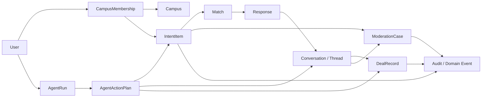

# 信息模型：意图、匹配与流转事实

| 项目 | 内容 |
| --- | --- |
| 适用读者 | 产品经理、后端工程师、数据工程师、测试工程师和需要理解状态机的移动端工程师 |
| 当前状态 | 统一意图、活动校园 session、审核案件/申诉、管理员 MFA、RLS 与显式信息流反馈均已实现；全请求 fail-closed tenant context 和真实用户质量评估仍待完成 |
| 事实来源 | `migrations/`、repository 查询、service 状态转换和 API JSON 模型 |
| 最后核对范围 | 迁移 `0001` 至 `0054`，商品、意图、信息流、聊天、成交、通知、审核、管理和 Agent 相关代码 |

这篇文档定义平台中“什么是事实、事实如何变化、哪些对象可以互相引用”。API 字段见 [API 参考](api-reference.md)，用户流程见 [业务流程](domain-flows.md)。

## 建模原则

1. 用户输入、系统推断和最终事实必须分开保存。
2. “出”和“收”是同一种信息意图的两个方向，不是两个互不相干的产品。
3. 匹配是可重新计算的结果，不是成交事实。
4. 聊天文本不构成正式报价或成交确认，`DealRecord` 才是平台记录的业务事实。
5. Agent 不能直接创造高风险事实，只能生成计划并调用受权限控制的 service。
6. 所有校园范围数据都必须能回答“属于哪个 campus”。

## 领域总图



图中的箭头表示业务关联，不表示每个对象当前都有独立数据库表。下面会明确当前映射和目标映射。

## 核心对象

### Campus 与 CampusMembership

[已实现] `Campus` 是租户与策略边界，当前保存学校标识、展示名称、允许的邮箱域名和启用状态。校园级分类、审核策略版本和时区覆盖仍是目标态。

[已实现] `CampusMembership` 表示一个全局用户在某个校园中的资格：

```text
user_id
campus_id
status: pending | verified | suspended | revoked
role: member | operator | admin
verification_method
verified_at
created_at / updated_at
```

用户可以拥有多个 membership，但每次请求必须有明确的 active campus context。跨校园读取默认禁止；管理员跨租户访问必须带审计原因。

[已实现] `campuses`、`campus_memberships`、学校邮箱 OTP、核心/通知/审核/审计 tenant 字段和设备级 active campus session 已落地；access claim 与 refresh session 保存同一 campus，切换时轮换 token，业务执行时再次验证 membership。推荐、公开用户页面和通知读取使用该校园。后台读权限使用 membership 的 `operator|admin`，平台写权限仍由全局用户角色控制。平台管理员近期认证与 TOTP MFA、关键 tenant 表的 FORCE RLS 也已落地。[目标态] membership 到期/定期刷新和所有应用查询自动注入 fail-closed RLS context 仍未完成。

### IntentItem

`IntentItem` 是用户希望信息如何流动的声明。当前 `intents` 是统一事实表，`inventory` 是 goods 意图兼容现有市场浏览面的投影；旧 listing API 继续可用。

| 字段 | 含义 | 当前映射 |
| --- | --- | --- |
| `id` | 意图稳定标识 | `intents.id`（UUID） |
| `campus_id` | 所属校园 | `intents.campus_id`，由活动 tenant context 写入 |
| `author_id` | 声明意图的人 | `intents.author_id`；他人 feed/matches 响应不序列化此字段 |
| `kind` | `goods_offer | goods_seek | companion | help | activity` | 数据库 CHECK 与 service 枚举共同约束 |
| `raw_input` | 用户原始表达 | 原文保存，允许未来重新解析 |
| `slots` | 结构化但允许模糊/缺失的槽位 | JSONB；价格、时间等支持 `whatever/flexible` 语义 |
| `confidence` | 对槽位解析的置信度 | 0–1；这是解析置信度，不是匹配分数 |
| `status` | 生命周期状态 | `draft | active | fulfilled | withdrawn | expired` |
| `visibility` | `campus | private` | 只有 active、未过期、campus 可见意图进入公共撮合池 |
| `valid_until` | 可选失效时间 | 过期后不再进入 feed/matches |
| `projected_listing_id` | goods 投影链接 | 一对一唯一索引指向兼容的 `inventory` 条目 |

新增 kind 或 slot 时仍必须先定义 schema、匹配语义和审核规则，不能把未知结构直接作为公开事实上线。listing 发布幂等继续由 `inventory.idempotency_key/idempotency_hash` 承担。

### Match

`Match` 表示系统在某一时刻计算出的“某条 wanted 与某条 offer 可能适配”。它不是用户承诺，也不是永久关系。

```text
wanted_id
offer_id
campus_id
hard_constraints_passed
score
reason_codes[]
model_version
computed_at
expires_at
```

[已实现] 当前 `/api/listings/{wanted_id}/matches` 实时查询 active offer，并按分类、预算、成色、关键词/向量和新鲜度匹配；`/api/intents/{id}/matches` 对五种 intent kind 先执行校园、生命周期和已声明 slots 的确定性硬约束。

[已实现] wanted 与 offer 必须属于同一 `campus_id`；`wanted_responses` 同时保存 tenant，并用复合外键约束两侧 listing。

[部分完成] intent feed/matches 已返回稳定 `rank_reason`、`match_summary`、`source` 和 `ranking_version`，原因只来自公开生命周期和双方已声明 slots。商品推荐也返回排序原因和版本。listing wanted matches 自身的稳定原因契约、短期物化、离线评估和公平性 guardrail 仍待完成；不得保存敏感用户画像作为公开原因。

### FeedFeedback 与 FeedPreferences

[已实现] `feed_feedback` 保存用户对一个 listing 或 intent 的显式指令：`hide | less_like_this | not_relevant`。`campus_id` 和分类/kind `signal_key` 均由服务端根据活动校园和目标资源派生；同一用户、校园和资源只有一条 standing signal，重试或改选 action 使用 upsert。

在当前已接入的首页商品 feed 与 intent feed/matches 中，三种 action 都会对该用户精确排除该资源；`less_like_this` 还会降低同分类或同 kind 候选的顺序。`feed_preferences.personalization_enabled=false` 会停用泛化亲和/降权，但保留这些入口的精确排除。`signals_reset_at` 让此前的收藏、买家成交意向和“少推荐这类”不再参与排序，不删除这些业务记录，也不恢复明确反馈过的具体资源。相似商品与 listing wanted matches 消费该事实仍是后续项。

### Response

`Response` 是用户对 Match 或 IntentItem 的明确动作。当前 `wanted_responses` 表保存提供方把自己的 offer 推荐给 wanted 的事实。

状态为：

```text
pending -> accepted
pending -> dismissed
pending -> withdrawn
```

同一提供方不能把同一 offer 对同一 wanted 重复创建 pending response。接受 response 不自动创建成交记录，也不自动发送消息；它只代表需求方认可这条候选信息。

### Conversation 与 Thread

`Conversation` 是一次独立沟通的业务事实，模式为 realtime 或 mail。`Thread` 是按对方用户聚合的产品视图，不合并底层状态机和消息历史。

| 概念 | 是否持久化 | 作用 |
| --- | --- | --- |
| Conversation | 是 | 保存参与者、模式、状态、商品上下文、主题和过期时间 |
| ConversationMember | 是 | 保存成员级未读、归档和阅读偏好 |
| ConversationEvent | 是 | 记录握手、关闭和过期等转换 |
| Thread | 查询聚合 | 让同一聊天对象在收件箱只出现一次 |
| Message | 是 | 保存文本、媒体引用、回复、quote、编辑和审核状态 |

Conversation 终止后不可复活。重新联系会创建新 Conversation，但仍显示在同一个 Thread 中。

### DealRecord

当前数据库和 API 仍使用 `orders`，产品语义已经是线下成交记录。文档统一称为 `DealRecord`，避免暗示平台支付或履约。

```text
intent_pending -> confirmed
intent_pending -> cancelled
confirmed -> cancelled
```

- 创建 `intent_pending` 不改变 offer 状态。
- 卖家确认时可以选择自动把 offer 标为 sold。
- 平台不保存“已付款”“已发货”作为新业务状态；旧状态只做兼容映射。
- 聊天消息、收款码展示和 Agent 回复都不能替代卖家确认。

### ModerationCase

[已实现] `ModerationCase` 统一承载机器图片拒绝、聊天消息举报、商品举报、用户举报、人工处置和申诉：

```text
open -> reviewing -> actioned | dismissed
actioned -> appealed -> resolved
appealed -> resolved
```

Case 保存校园、资源引用、来源引用、机器或人工判断、公开理由、受限的内部证据、处置结果和事件时间线。`moderation_appeals` 保存一次性申诉和独立复核结果；普通用户接口不返回举报人身份或 `internal_details`。`content_reports` 承载商品/用户举报，`chat_message_reports` 承载消息举报，两者都在同一事务中关联统一案件，并在案件流转时同步举报状态。

当前 intake、开始复核和 dismiss 已统一；机器拒绝也可在案件复核后恢复对应媒体状态。商品/用户案件尚未拥有通用、可逆的 restrict/restore effect，紧急下架或封禁仍走独立的近期认证与管理员审计流程。

### AgentRun 与 AgentActionPlan

[已实现] AgentRun 的部分事实仍分散在聊天消息、LLM metrics、工具结果和日志中；统一 `AgentRun` 仍是目标态。每个受支持的 Agent 写动作已经形成 `AgentActionPlan`：

```text
AgentRun: request -> routing -> retrieval -> model/tool steps -> outcome
ActionPlan: pending -> confirmed_once (L3) -> executing -> executed | failed
            pending -> cancelled | expired
```

ActionPlan 保存待执行输入快照、风险级、短期 confirmation token 和执行结果，不是已执行事实。L2 一次确认，L3 二次确认；执行时重新检查 tenant、membership、权限和资源状态。通用资源版本快照比较仍待补齐。

### AuditEvent 与 DomainEvent

两者不能混为一谈：

- `AuditEvent` 面向责任追踪，回答谁在何时因何理由做了什么。
- `DomainEvent` 面向系统协作，回答哪个业务事实已经发生，需要哪些异步消费者处理。

目标公共事件信封：

```json
{
  "event_id": "uuid",
  "event_type": "intent.published.v1",
  "aggregate_type": "intent_item",
  "aggregate_id": "uuid-or-compatible-id",
  "campus_id": "uuid",
  "actor_id": "uuid",
  "schema_version": 1,
  "occurred_at": "RFC3339 timestamp",
  "trace_id": "request correlation id",
  "payload": {}
}
```

业务写入与 outbox event 必须在同一数据库事务提交。日志或进程内 channel 不能替代事件事实。

## 信息生命周期

### 发布与公开

```text
draft
  -> submitted
  -> text screening
  -> persisted as pending/active
  -> media moderation
  -> publicly discoverable
```

当前文本在写入前同步审核，媒体使用异步任务。[目标态] 未通过媒体审核的图片进入隔离区，listing 可以先以安全占位图公开，也可以按校园策略保持 pending；不能先公开原图再等待撤回。

### wanted 与 offer 匹配

```text
wanted(active) + offer(active)
  -> campus/category/budget/condition hard filters
  -> lexical/vector retrieval
  -> ranking and diversity
  -> Match with reason codes
  -> optional Response
  -> optional Conversation
  -> optional DealRecord
```

每一步都是独立事实。系统不能因为用户打开匹配卡片就创建联系，也不能因为双方聊天就自动确认成交。

### 删除、关闭与保留

- listing 删除应从公开检索和向量召回中移除，但审计和法定保留数据按策略处理。
- wanted fulfilled 后停止新匹配，已有 response 和 conversation 保留历史。
- 用户对消息“删除”当前只对自己隐藏，举报和审核记录仍保留。
- 账号删除、内容保留和安全事件保全的冲突由[信任与安全](trust-safety.md)定义。

## 多租户不变量

[目标态] 所有实现必须满足：

1. IntentItem、Space、Conversation、ModerationCase、Notification 和 AuditEvent 有明确 `campus_id`。
2. repository 查询默认要求 tenant context，不提供无范围的普通用户查询。
3. 用户之间跨校园联系默认返回不可联系，不泄露对方 membership。
4. 外键和复合唯一约束防止把 A 校园的 response 关联到 B 校园的 intent。
5. 管理员跨校园操作必须使用平台角色、理由和审计事件；强认证仍是上线前目标。
6. 向量和全文检索必须先限定 campus，再计算相似度。

## ID 与兼容策略

当前系统处在 TEXT id 与 UUID shadow column 并存阶段。公开 API 继续把 ID 序列化为字符串，内部逐步采用 UUID 语义。

- 不在文档中把“字符串”误写成“任意字符串”。
- 新目标表使用 UUID 主键。
- repository 封装兼容解析，不让 handler 自行拼接新旧 join。
- API 版本迁移期间保持旧字段名，直到有明确弃用窗口。
- 任何 backfill 都要有 divergence 检查和混合数据测试。

## 事实来源优先级

发生冲突时按以下顺序判断当前实现：

1. 已应用 migration 和数据库约束。
2. service 中的事务与状态转换。
3. repository 查询和 handler 权限校验。
4. API 响应模型与 Flutter 解析。
5. 文档和 UI 文案。

发现文档与更高优先级事实不一致时，应先修文档并记录是否需要后续代码整改，不能为了让文档“正确”而假装目标能力已经存在。
