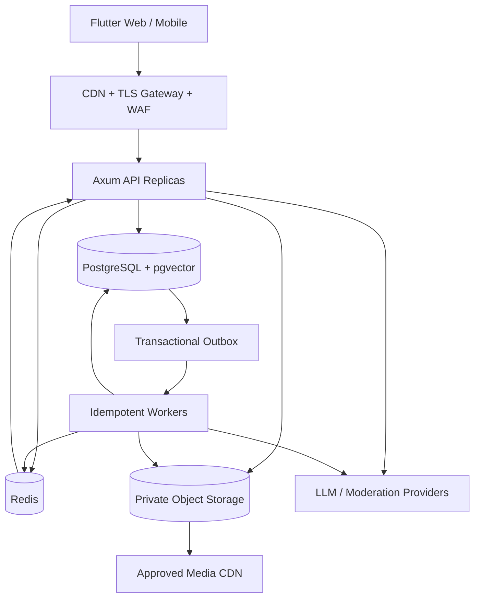

# 生产架构：模块化单体、多校园与可靠运行

| 项目 | 内容 |
| --- | --- |
| 适用读者 | 架构师、后端/移动端工程师、SRE、数据库管理员和技术负责人 |
| 当前状态 | 当前可作为单实例演示栈运行；多副本实时通信、持久事件、多校园隔离和完整灾备属于目标态 |
| 事实来源 | `src/main.rs`、`src/api/mod.rs`、配置加载、Dockerfile、Compose、PostgreSQL migrations、metrics 和 worker 实现 |
| 最后核对范围 | HTTP/SSE/WebSocket、PostgreSQL/pgvector、Redis 限流、对象存储、事件 channel、后台 Worker 和部署配置 |

这篇文档描述面向 10 万注册用户、约 1 万日活、数所高校和数千实时连接的目标架构。当前代码结构见[当前架构](architecture.md)，具体配置见[运行、配置与排错](operations.md)。

## 架构原则

1. 保持模块化单体，先解决边界、数据一致性和可观测性，不以微服务数量衡量生产成熟度。
2. PostgreSQL 是业务事实来源；Redis、缓存、向量索引和 WebSocket 状态都可以重建。
3. 同步事务只包含必须共同成功的业务事实，通知和索引更新通过持久事件异步执行。
4. 所有请求携带用户、campus 和 trace context，租户范围不能靠调用者自觉。
5. LLM 是可降级依赖，不能成为登录、浏览、普通搜索、发布表单和聊天的单点故障。
6. 先定义 SLO、容量和拆分阈值，再决定是否引入新基础设施。

## 当前与目标拓扑

### 当前实现

```text
Flutter Web/App
  -> Axum single process
       -> PostgreSQL + pgvector
       -> optional Redis rate limit
       -> in-process mpsc BusinessEvent
       -> in-process WebSocket connections
       -> moderation / expiry workers
       -> optional OSS STS and external LLM/moderation APIs
```

当前结构适合本地开发和单实例演示。主要生产风险是：进程内事件在崩溃后丢失，WebSocket 连接表不能跨实例，静态 `/uploads` 不适合多副本，对象审核和通知缺少统一 dead-letter/重放机制。

### 目标实现



Flutter Web 静态文件由 CDN 托管，不由 API 进程提供。TLS、请求大小、防护和静态缓存位于 edge；业务认证、授权和 tenant scope 仍由后端执行。

## 模块化单体边界

目标单体按领域模块组织，而不是按 HTTP 动词或数据库表随意分割：

| 模块 | 负责 | 不负责 |
| --- | --- | --- |
| Identity | 账号、token、membership、角色 | 商品和聊天状态 |
| Intent | offer/wanted、分类、状态和可见性 | 推荐排序和成交确认 |
| Discovery | 关键词/向量召回、Feed、匹配和反馈 | 修改 listing 事实 |
| Communication | thread、conversation、message、space、call signaling | 线下付款和 Agent 授权 |
| Deal | 成交意向、确认、取消、自动下架 | 支付、物流、退款 |
| Agent | 路由、RAG、ActionPlan、工具适配和评估 | 业务权限最终判断 |
| Trust | 审核、举报、申诉、屏蔽和审计 | 普通推荐排序 |
| Platform | 配置、metrics、outbox、任务、存储和 provider | 领域状态机 |

模块通过 service 接口和 domain event 协作。handler 不能跨模块直接写 SQL，repository 不能决定业务状态转换，worker 不能绕过 service 重新实现规则。

只有满足以下任一条件才考虑拆独立服务：

- 模块有独立扩容需求且数据库压力可清楚隔离。
- 安全或合规要求需要独立运行身份和网络边界。
- 发布频率和故障域已经严重影响其他模块。
- 团队有明确 owner、on-call 和服务运维能力。

“文件太大”不是拆微服务理由，先在单体内拆模块。

## 多校园租户架构

[目标态] 使用共享 PostgreSQL schema：

- `users` 保存全局账号。
- `campuses` 保存租户和策略配置。
- `campus_memberships` 保存用户在校园中的资格和角色。
- IntentItem、Space、Conversation、ModerationCase、Notification、OutboxEvent 和 AuditEvent 带 `campus_id`。

租户隔离分四层：

1. API 从 token/session 和请求上下文确定 active campus，不接受模型或普通 body 任意指定。
2. service 要求 `TenantContext`，跨校园动作默认拒绝。
3. repository 查询必须显式绑定 campus，lint/review 禁止普通路径调用无范围查询。
4. 关键表使用复合外键、唯一约束和 RLS 作为 defense in depth。

后台 worker 从事件中的 campus context 执行，不能使用“系统用户”跳过范围。平台管理员跨校园查询使用独立接口、理由和审计。

## PostgreSQL 与 pgvector

10 万用户规模继续使用 PostgreSQL 承担：

- 账号、意图、聊天、成交、审核和审计等关系事实。
- 关键词查询和受限全文搜索。
- 商品/需求 embedding 与 pgvector 相似检索。
- transactional outbox 和 worker lease。

生产要求：

- 主库与测试库完全隔离，应用使用最小权限账号。
- 连接池设置每实例上限，总连接不超过数据库安全容量。
- 慢查询、锁等待、复制延迟、表膨胀和索引命中有监控。
- 大表按真实数据量和查询模式决定分区，不预先给所有表分区。
- 向量检索先过滤 campus、status 和 direction，再做距离排序。
- embedding 模型、维度和版本与 document 一起保存；迁移使用双索引/重建，不在线修改已有向量含义。

考虑拆独立搜索系统的触发条件：Feed/Search p95 连续超出 500ms、向量索引维护显著影响事务、单库无法满足容量或需要复杂多路召回。拆分前仍以 PostgreSQL 事实和 outbox 增量同步为准。

## Transactional Outbox

当前进程内 `mpsc` 可以保留为单实例快速通知，但不能作为生产事实。目标 outbox 表至少包含：

```text
id
campus_id
event_type
aggregate_type
aggregate_id
schema_version
payload
trace_id
created_at
available_at
attempt_count
locked_at / locked_by
processed_at
last_error
dead_lettered_at
```

业务事务同时提交聚合更新和 outbox 行。Worker 使用 `FOR UPDATE SKIP LOCKED` 或等价 lease 批量消费。

每个消费者必须：

- 使用 event id 或业务幂等键防重复副作用。
- 区分可重试和不可重试错误。
- 使用指数退避和最大尝试次数。
- 超限后进入 dead-letter，不无限占用队列。
- 支持受审计的人工重放。
- 记录 lag、成功率、重试和 dead-letter metrics。

通知、embedding 更新、媒体审核、搜索投影和 WebSocket fan-out 优先迁入该机制。

## Redis 与实时通信

Redis 只保存可丢失或可重建状态：

- 分布式限流计数。
- WebSocket 实例间 pub/sub fan-out。
- 短期 call signaling 状态。
- 有短 TTL 的 Feed/cache 结果。

消息正文、会话状态、通知未读和成交记录不能只存在 Redis。

WebSocket 连接由各 API replica 本地维护，事件经 Redis channel 按用户/campus 路由。客户端断线后使用数据库列表和游标补偿，不依赖 Redis 重放完整历史。

邮件和 realtime 都不发送 typing/read/online 给对方；realtime 事件也不能把“本机 socket 已连接”解释为“对方在线”。

## 媒体和对象存储

生产媒体路径：

```text
client asks for an owner-scoped upload target
  -> private deployment PUTs to one server-generated object key
  -> API probes the object and stores the verified reference
  -> worker validates/decode/moderates
  -> approved object is served through a short-lived signed GET
```

这是当前仓库的真实路径；生产 CDN 前置、缩略图派生和 quarantine-to-delivery
对象复制仍是部署侧/后续阶段，不应在 API 响应或验收记录中提前宣称已接入。

要求：

- 使用短期、最小 scope 的上传凭证。
- Web 端直传时，bucket CORS 只允许已登记的 `CORS_ORIGINS` 对应来源、`PUT` 和 `Content-Type`；不使用 `*`，移动端不依赖 CORS。
- 文件名不作为权限或 MIME 来源。
- 原图、缩略图、头像、商品图、聊天媒体和收款码使用不同策略。
- 对象 key 不包含完整邮箱、学号或用户名。
- 删除和审核撤回会失效 CDN，并按数据策略清理源对象。
- Base64 fallback 只用于旧数据兼容，记录使用量并设退出门槛。

## API 与兼容

[目标态] 新生产契约使用 `/api/v1`，当前未版本化 `/api/*` 保持兼容窗口。

统一约束：

- 列表使用 cursor pagination，旧 offset 接口在兼容期保留。
- 写接口接受 `Idempotency-Key`，特别是发布、联系、消息、Agent confirm 和成交动作。
- 错误使用稳定 `code`、用户可读 `message`、`trace_id` 和可选 `details`。
- 响应不暴露内部 SQL、provider、屏蔽关系和审核规则。
- 破坏性变化发布新版本，弃用有文档、metrics、截止时间和客户端迁移计划。
- WebSocket event 带 `event_id`、`event_type`、`schema_version` 和必要游标。

现有和目标接口清单见 [API 参考](api-reference.md)。

## SLO 与容量基线

目标容量假设：10 万注册用户、1 万日活、数千并发 WebSocket、正常峰值数百 RPS。上线前必须用真实业务分布压测，而不是只测健康检查。

| 用户能力 | SLI | 目标 |
| --- | --- | --- |
| 核心 API | 成功响应可用性 | 月度 99.9% |
| 普通读取/写入 | 服务端 p95 | 小于 300ms，不含媒体和 LLM |
| Feed/Search | 服务端 p95 | 小于 500ms |
| 在线消息 | 持久化后投递 p95 | 小于 1s |
| Agent streaming | 首 token p95 | 小于 3s，provider 正常时 |
| 媒体审核 | 队列到决定 p95 | 由上线策略设定并持续告警 |
| 数据恢复 | RPO / RTO | 15 分钟 / 2 小时 |

SLO 排除项必须有限且可审计，不能把所有 provider 或数据库故障都排除。错误预算耗尽时优先稳定性、容量和安全修复，暂停扩大风险的新功能。

## 可观测性

### 请求与追踪

每个入口生成或接收 `trace_id`，贯穿 HTTP、service、SQL、outbox、worker、provider 和 WebSocket event。路径 metrics 对动态 ID 归一化，避免标签基数爆炸。

### 必要指标

- API 请求量、状态、延迟、body 拒绝和限流。
- PostgreSQL 连接、慢查询、锁、事务回滚和 outbox lag。
- WebSocket 连接、投递、丢弃、断线和补偿读取。
- Worker lease、成功、重试、dead-letter 和处理时延。
- LLM 首 token、总延迟、token、工具循环、错误和熔断。
- Moderation backlog、决定时延、申诉和改判。
- Feed 候选量、过滤量、无结果率和排序版本。

日志必须结构化并脱敏。Metrics 不能使用 user_id、listing_id 或 trace_id 作为高基数 label；这些放在受控日志和 trace 中。

## 部署与发布

生产环境至少分为 development、staging 和 production，数据库、对象存储、Redis、密钥和 provider 配额相互隔离。

发布流程：

1. CI 检查格式、静态分析、单元/集成测试、migration 验证、依赖和镜像扫描。
2. 构建不可变后端镜像和带明确 API base URL 的 Flutter Web 产物。
3. 在 staging 从空库和升级库各跑一次 migration。
4. 先部署兼容 schema，再部署读写新字段的应用，最后清理旧字段。
5. 使用滚动或 canary 发布，观察错误预算、DB、outbox 和关键旅程。
6. 应用回滚不回滚已提交 migration；schema 必须保持前后兼容。

Feature flag 用于隔离 Agent 写工具、多校园、Feed 新排序和 Secret Chat 弃用等高风险变化。Flag 需要 owner、默认值、过期日期和清理任务。

## 备份与恢复

- PostgreSQL 使用连续归档/PITR 或等价能力满足 RPO 15 分钟。
- 定期全量备份，备份加密并与生产权限隔离。
- 对象存储启用版本/生命周期策略，公开 CDN 不是备份。
- KMS 密钥材料和数据备份分开保护，确保既能恢复又不能单独解密。
- 每季度至少做一次 staging 恢复演练，记录实际 RPO/RTO。
- 恢复后验证账号、membership、offer/wanted、聊天、成交、审核、outbox 和向量索引。
- 向量索引和缓存可以重建，但重建脚本、容量和时间要纳入恢复计划。

## 故障模式与降级

| 故障 | 用户体验 | 系统动作 |
| --- | --- | --- |
| LLM provider 不可用 | 显示手工搜索/表单，聊天业务继续 | 熔断 Agent 调用，不阻塞核心 API |
| Embedding 不可用 | 使用关键词、分类和新鲜度 | outbox 保留重建任务 |
| Redis 不可用 | 列表和已持久化消息仍可读取，实时提示稍后补偿 | 限流进入批准的本地保守模式，禁止错误放开 |
| 对象存储不可用 | 保留表单内容，媒体稍后重试 | 不回退为大 Base64 主路径 |
| 审核 provider 不可用 | 媒体保持 pending/占位 | 队列重试并告警，不直接公开 |
| WebSocket fan-out 故障 | 客户端轮询/刷新补偿 | 数据库消息和通知仍是事实 |
| 数据库只读或不可用 | 阻止写入并清楚提示 | 不在缓存伪造成功 |

## 生产就绪检查

- 多校园 scope、身份门槛和管理员边界有集成测试。
- 业务事件迁入持久 outbox，关键消费者支持幂等和 dead-letter。
- WebSocket 多副本 fan-out 和断线补偿通过压力测试。
- 媒体隔离、审核、缩略图和删除路径完整。
- SLO dashboard、告警、runbook 和 on-call owner 明确。
- 备份恢复、密钥轮换、数据库升级和应用回滚完成演练。
- LLM、Redis、对象存储和审核 provider 故障时有可验证降级。
- 容量测试达到目标峰值并保留安全余量。
