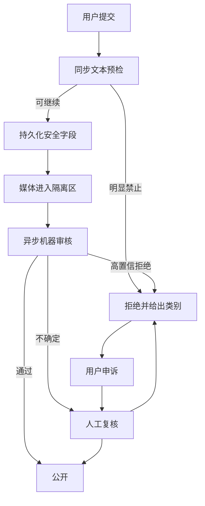

# 信任与安全：身份、审核、隐私与平台治理

| 项目 | 内容 |
| --- | --- |
| 适用读者 | 安全工程师、后端工程师、产品经理、校园运营、管理员和审核人员 |
| 当前状态 | 已有认证、封禁、文本规则、异步图片审核、ModerationCase、举报、申诉、屏蔽和校园管理员审计；MFA、RLS、对象存储隔离和密钥管理仍是目标态 |
| 事实来源 | 认证中间件、ModerationService、`moderation_jobs`、举报/屏蔽 API、用户发现设置和管理员审计日志 |
| 最后核对范围 | 账号、校园身份、公开内容、私聊、群组、收款码、Agent 数据和管理操作 |

这篇文档定义平台如何建立可信边界，并不构成法律意见。生产上线前必须由学校政策负责人、隐私与法律专业人员复核适用规则；技术文档不得自行宣称“已经完全合规”。

## 安全目标

续樟的安全目标不是“拦下越多内容越好”，而是同时做到：

1. 不让明显违法、有害、诈骗或骚扰内容借平台扩散。
2. 不让管理员、Agent 或其他用户获得超出任务需要的数据。
3. 给被误伤用户清楚的解释、补救和申诉路径。
4. 让关键决定可追踪，但不把普通用户活动无限期保存。
5. 在不托管资金的前提下，清楚提示线下付款和交付风险。

## 威胁模型

| 威胁 | 示例 | 主要控制 |
| --- | --- | --- |
| 账号滥用 | 撞库、refresh replay、被封禁后继续连接 | Argon2、token 旋转、JTI denylist、设备和速率信号 |
| 身份冒用 | 冒充本校学生、伪造学号 | 校园邮箱验证、membership 状态、最小公开标识 |
| 角色冒用 | 用生成分身伪装真人外貌、他人身份或平台 Agent | 角色披露、统一风格、媒体审核、身份与外观分层 |
| 违禁内容 | 违禁物品、诈骗、博彩、成人和暴力内容 | 同步文本预检、媒体隔离、异步审核、人工复核 |
| 骚扰与隐私 | 重复联系、开盒、传播联系方式 | 会话限流、屏蔽、举报、隐私检测和中性错误 |
| 支付风险 | 伪造或替换收款码、诱导提前付款 | 自愿公开、风险提示、审核、变更审计、不声称平台担保 |
| Agent 越权 | 模型替用户发布、报价或泄露信息 | ActionPlan、确认、service 校验、工具 allowlist |
| 管理员越权 | 无理由查看或修改用户数据 | RBAC、强认证、理由、审计和定期复核 |
| 租户泄露 | A 校园搜索到 B 校园私有信息 | tenant scope、复合约束、RLS 和隔离测试 |
| 依赖攻击 | 恶意媒体 URL、SSRF、供应链包 | URL allowlist、扫描、锁定依赖和构建证明 |

## 身份与访问层级

### 账号与校园资格分离

[目标态] `User` 是平台账号，`CampusMembership` 是访问某个校园的资格。membership 可以过期、暂停或重新验证，而不需要删除全局账号。

| 能力 | 游客 | 注册未认证 | 校园认证成员 | 校园运营 | 平台管理员 |
| --- | --- | --- | --- | --- | --- |
| 浏览公开信息 | 允许 | 允许 | 允许 | 允许 | 允许 |
| 收藏 | 不允许 | 允许 | 允许 | 允许 | 允许 |
| 发布出/收 | 不允许 | 不允许 | 允许 | 允许 | 仅运维需要 |
| 联系用户 | 不允许 | 不允许 | 允许 | 允许 | 不用于日常沟通 |
| 群组/频道参与 | 不允许 | 不允许 | 按空间规则 | 管理本校园 | 审计和应急 |
| 审核内容 | 不允许 | 不允许 | 举报 | 本校园范围 | 跨校园重大事件 |

认证失败只说明需要完成资格验证，不泄露另一个账号、邮箱或 membership 是否存在。

### 账号安全

[已实现] access token 带 JTI，logout 可撤销，refresh token 旋转并检测 replay，被封禁用户不能登录或 refresh。

[已实现] 平台管理员的封禁、下架、角色变更、代登录、token 撤销、成交记录修改和审核处置需要 10 分钟内的密码认证。登录/注册 token 带 `auth_time`；refresh、切换校园和旧 token 不带近期认证能力。Flutter 只负责展示锁定状态，后端始终强制校验。

[部分完成] 平台管理员 TOTP MFA 已实现并在密码 step-up 中强制；生产上线前应为全部平台管理员完成注册，校园运营 MFA 仍是目标态。账号安全事件应能撤销全部会话，并向用户发送不包含敏感细节的通知。

## 内容审核生命周期

### 同步文本预检

[已实现] 商品、用户名、留言主题、直聊文本、编辑消息和 AI 输入会经过本地规则。规则覆盖明显高风险类别和可配置关键词。

返回用户的是原因类别和可改正建议，不返回具体命中词、内部阈值或绕过方式。同步规则必须有版本，便于解释同一内容为何在不同时间得到不同结果。

### 媒体隔离

[已实现] listing 首次提交含图片时，listing 行的首次 commit、资源 `pending` 状态和 `moderation_jobs` 在同一数据库事务中提交，不再存在 listing 已提交但首个审核任务丢失的窗口。公开读取路径只在 `approved` 时返回媒体 URL，pending/rejected/failed 一律不返回（所有者可见自己的待审图）。审核关闭的部署显式标记 review-exempt。

[已实现] 对象存储层面：bucket 私有（无匿名读），服务端只对 approved 媒体下发短期 presigned URL，因此已知直链在存储层同样不可访问。对真实 S3 实现验证过匿名 403、篡改签名拒绝、过期拒绝。[目标态] CDN 前置与缩略图派生仍待接入。

下载和审核服务要限制：

- 允许的协议、域名和对象存储 bucket。
- MIME、文件头、像素、时长和文件大小。
- 解码时间、重定向次数和压缩炸弹。
- SVG/HTML 等可执行内容默认拒绝。
- 审核失败重试次数和 dead-letter 状态。

### ModerationCase 与申诉

[已实现] `moderation_cases`、`moderation_case_events` 和 `moderation_appeals` 把机器拒绝、聊天/商品/账号举报、人工处置和申诉串成校园作用域案件。图片 Worker、聊天举报和资源举报均在同一数据库事务中创建/关联案件；历史拒绝任务和既有举报由 `0034_moderation_cases.sql` 回填。普通用户通过内容审核页只能看到安全摘要，不看到审核人员、举报人、命中词或内部证据。

[已实现] 平台管理员可以开始复核或驳回案件；媒体和消息案件还支持限制与恢复。申诉只能提交一次，并且必须由未参与原决定的另一位管理员复核。改判会撤销该案件拥有的媒体/消息审核效果、写案件事件和管理员审计，但不会自动训练模型。

[已实现] `POST /api/listings/{id}/report` 和 `POST /api/users/{id}/report` 使用 `VerifiedTenant`：校园从当前 session 派生，`subject_user_id` 由服务端按路径目标及其同校关系查询确定，请求体不能覆盖；跨校或不存在目标不可枚举。`reason` 限 1–80 字、`details` 限 1000 字，每个举报人每小时最多新建 10 条。同一举报人对同一校园/目标只保留一条未处理 standing report，重复提交更新证据；已 `resolved`/`dismissed` 后的新举报创建新 report 和新案件。

[已实现] listing/user 举报的 intake、`start_review` 和 `dismiss` 都不改变 `inventory.status` 或 `users.status`。在有 case-owned、可组合、可按来源撤销的 restriction/effect 记录之前，通用 `restrict`/`restore` 刻意不对 listing/user 开放：不能把审核恢复写成 `active` 而复活已售/已删内容，也不能因某一案件改判而解除其他来源的封禁。紧急处置仍使用独立的管理员 takedown/ban 流程，需要近期认证并单独审计；案件驳回或改判不会自动 relist/unban。

[目标态] 校园运营当前只读案件队列；后续只能在最小权限和 MFA 完成后开放受限处置。案件仍需增加通知模板、申诉 SLA、证据保留策略和多级风险策略。

## 私聊、群组和举报

### 可治理通信

生产私聊使用 TLS 传输和服务端加密存储。服务器在严格授权、审核或安全事件流程中必须能够解密内容，因此不承诺端到端加密。

[实验中][待弃用] 当前 Secret Chat API 保存客户端密文，服务器不可读。它不能进入生产承诺，也不能作为规避审核的正式入口。迁移策略是：

1. [已实现] 停止向新用户宣传和默认展示 Secret Chat：移动端创建入口已移除。
2. [已实现] 禁止创建新的长期 E2EE session（后端默认 403，仅 `SECRET_CHAT_NEW_SESSIONS_ENABLED` 迁移开关可恢复），保留已有历史的兼容窗口。
3. 为用户提供删除或导出其本地可解密历史的说明。
4. 新安全会话使用服务端信封加密和授权解密，不复用“Secret Chat”名称。
5. 在兼容窗口结束后移除创建和发送接口，保留必要审计和迁移记录。

### 加密与密钥

[目标态] 消息正文和收款码等高敏感对象采用信封加密：数据密钥加密内容，密钥加密密钥由 KMS/HSM 管理。应用普通日志和数据库只看到密文或引用。

- 密钥按环境和用途隔离，生产密钥不进入 `.env` 文件或镜像。
- 解密权限使用独立 service identity，普通管理员页面没有通用解密按钮。
- 每次人工解密需要案件、理由、操作者和审计事件。
- 支持密钥轮换、旧密文解密和紧急吊销演练。
- 备份包含密文，但密钥备份和数据备份分离管理。

### 反骚扰

[已实现] 新建会话有总量和同一接收方限流，屏蔽后双方不能继续创建或发送，旧历史只读。

[目标态] 风险控制还要结合账号年龄、membership、举报历史和异常速度，但不能仅凭模型画像永久封禁。被屏蔽或不存在时统一返回“暂时无法联系”，不泄露关系。

群组和频道需要独立的成员角色、禁言、移除、举报和管理员权限。频道管理员不能读取成员私聊。

## 用户发现与最小披露

[已实现] 用户可控制是否通过用户名、完整邮箱和学号被查找；邮箱和学号默认关闭，结果只显示脱敏匹配信息。

生产原则：

- 查找完整邮箱或学号只做精确匹配，不支持前缀枚举。
- 不返回当前用户自己和被屏蔽关系的具体状态。
- 关闭发现不影响商品、既有会话和成交记录中必要的身份显示。
- 管理员搜索属于审计操作，不复用普通用户 lookup 接口。
- 校园 membership 过期后立即停止新的身份发现和联系能力。

## 角色化社交分身

[部分实现] 角色分身是可编辑的公开展示资源，不是身份证明、真人照片认证或可自主行动的代理。校园认证徽标只由 `CampusMembership` 决定，不能因角色外观、服装、标签或模型判断改变。`0063_social_personas` 存受控 token 和用户选择标签，`0070_social_persona_assets` 另外承载经过对象探测和审核门槛的候选图片；两者都不接收会改变权限的开放式人格指令。

目标态三种呈现模式需要清楚披露：照片风格化、特征映射和完全角色化。当前 v1 只开放特征映射和完全角色化，后者标注“角色形象”；照片风格化也不得声称与真人一一对应。平台不得从角色推断性别、年龄、族裔、健康、性取向或其他敏感属性，也不得把这些推断用于联系权限或推荐。

生成与发布遵循以下边界：

- 默认使用统一风格和受控部件，开放式 prompt 只作为受审核的候选输入，防止批量同质化、色情化和冒用知名人物或其他用户。
- 上传照片只用于用户明确选择的本次转换；原图用途、保留时间、删除入口和 Provider 去向在上传前说明，不用于人脸识别、身份验证或模型训练。
- 生成结果和自定义素材沿用私有对象存储、隔离、媒体审核与申诉流程；`persona/{campus}/{persona}/{asset}` key 由服务端生成，客户端声明上传完成不会直接变成公开事实，审核前不公开。
- 用户可以随时恢复普通头像、隐藏分身或删除候选；选择新素材会再次要求显式发布，撤销会停止公开投影并进入耐久远端清理；生成服务故障不影响资料、留言和连接。
- 公开标签和“可留言 / 可连接 / 忙 / 稍后”只来自用户主动设置或明确规则，不根据 read、typing、online、位置、日历或后台活动推断。
- v1 外观、标签、接近方式和状态均经过服务端白名单校验；草稿不公开，发布/归档/编辑均写入 `social_persona_audits`，跨校园读取按不存在处理。
- 角色动作不能伪装 acknowledgement、连接接受或成交确认；这些仍由独立的用户动作和领域事实驱动。
- 用户分身、平台 Agent 和真人资料使用可区分的视觉标识。Agent 参与私聊必须由用户主动触发并在本端清楚显示，分身本身不意味着 AI 参与。

角色编辑器还要支持减少动态、静态替代文本、高对比度和非角色头像 fallback；身份与接近方式不能只靠颜色、姿态或动画表达。产品不引入好感度、喂养、连续签到或随机召回，因为这些机制会把身份表达变成注意力操控。

## 收款码与线下交易

[已实现] 用户可以分别上传微信和支付宝收款码，并控制是否在个人主页公开。

收款码是高风险个人信息，不是普通头像：

1. 默认不公开，只有用户主动打开对应平台开关才展示。
2. 上传后必须校验文件头和 MIME，并进入图片审核。
3. 公开页持续显示“平台不托管资金，请确认商品和对方身份后线下付款”。
4. Agent 不得主动读取、转发或公开收款码；公开开关属于 L3 动作。
5. 收款码变更、公开和关闭需要写审计事件，并让用户能立即撤回。
6. 平台不得把二维码解析结果当作收款人实名验证。

平台只记录线下成交意向和卖家确认，不提供支付成功、退款、赔付或物流状态。

## Agent 数据治理

- Agent 只接收完成当前任务所需的最少上下文。
- 用户私聊默认不用于模型训练或推荐画像。
- 回复助手由用户主动点击才读取最近 12 条纯文本，不读媒体，不自动发送。
- Provider 日志和 tracing 不保存 access token、refresh token、密码、完整邮箱、学号和收款码。
- 敏感工具执行需要 ActionPlan、确认、service 校验和审计。
- 模型输出中的违规内容在展示或执行前仍需经过策略检查。

## 数据分类与保留

生产上线前必须由产品、安全和法务共同批准保留矩阵。文档先定义类别和删除机制，不擅自宣称法定期限。

| 数据类别 | 示例 | 控制要求 |
| --- | --- | --- |
| 公开内容 | active offer/wanted、公开用户名 | 按用户状态和审核结果控制公开 |
| 账号数据 | 邮箱、密码 hash、membership | 强访问控制，账号生命周期删除/匿名化 |
| 高敏感数据 | 收款码、私聊正文、举报附件 | 字段/对象加密、按案件授权解密 |
| 业务事实 | 成交记录、会话事件、审核决定 | 状态不可被客户端覆盖，按策略保留 |
| 安全审计 | 管理员操作、token 撤销、解密访问 | 防篡改、限制访问、定期复核 |
| 可观测数据 | metrics、trace、错误日志 | 脱敏、短期保留、避免正文和密钥 |

每类数据必须有 owner、用途、存储位置、访问角色、保留规则、删除方式和备份处理。用户删除请求不能只删主库而永久保留可直接恢复的公开数据；同时，安全案件和法定保全需要单独受控。

## 管理员与审核员安全

- 平台管理员、校园运营和审核员使用不同角色，默认不能互相替代。
- 管理操作必须带 actor、tenant、target、reason、trace_id 和结果。
- impersonation 只用于明确支持场景，显示持续警示并禁止执行高风险隐私或角色操作。
- 管理后台不得显示完整密码 hash、token、密钥或不必要的私聊正文。
- 高风险操作支持双人复核或事后抽查。
- 定期检查长期未使用权限、异常批量访问和审计缺口。

## 安全事件响应

事故按“发现、限制、保全、修复、通知、复盘”处理：

1. 通过告警、举报或审计发现异常。
2. 使用最小动作限制影响，例如撤销 token、关闭上传、暂停某校园发布或禁用高风险工具。
3. 保全相关日志和事件，不进行无边界全库复制。
4. 修复漏洞并验证普通用户路径没有继续暴露。
5. 按批准流程通知受影响方和责任人。
6. 复盘根因、检测缺口、修复项 owner 和截止时间。

运行手册、备份和恢复见[生产架构](production-architecture.md)与[运行排错](operations.md)。

## 上线门槛

- 校园身份门槛在后端权限层生效，不只隐藏前端按钮。
- 媒体默认隔离，审核失败不会公开原始对象。
- [已实现] 举报、案件、人工处理和申诉形成可追踪链路；媒体拒绝与聊天/listing/user 举报会同事务创建或关联案件并保存状态事件。
- Secret Chat 不作为生产入口，迁移和用户说明明确。
- 高敏感数据加密、解密授权、审计和轮换演练完成。
- 收款码默认私有并通过审核，风险文案不暗示平台担保。
- 管理员 MFA、最小权限和审计检查完成。
- 正式上线前完成学校政策、隐私和法律专业复核。
